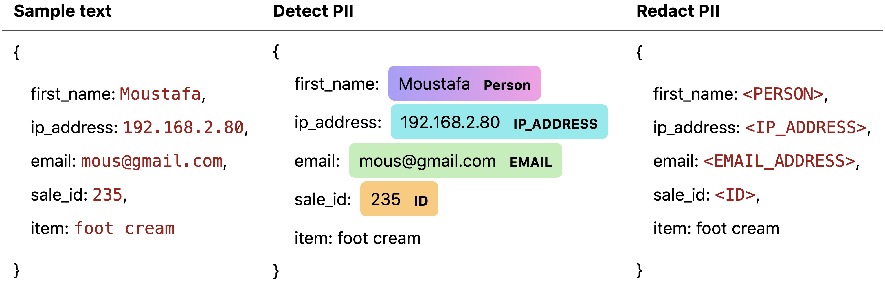
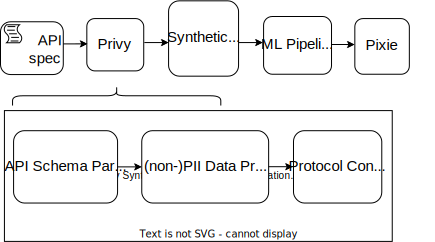
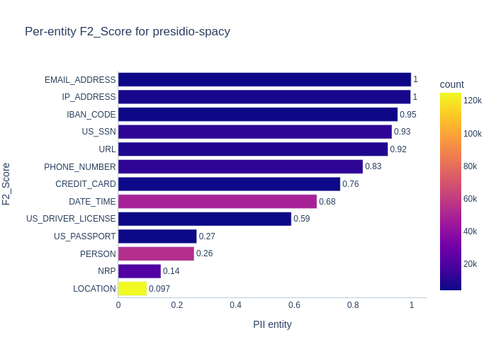
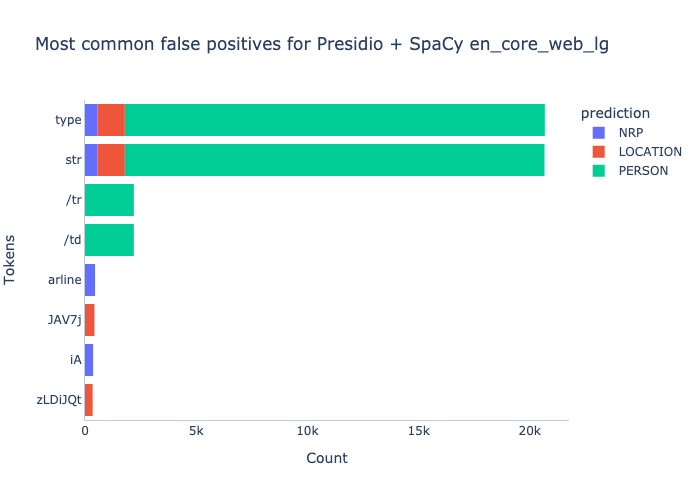
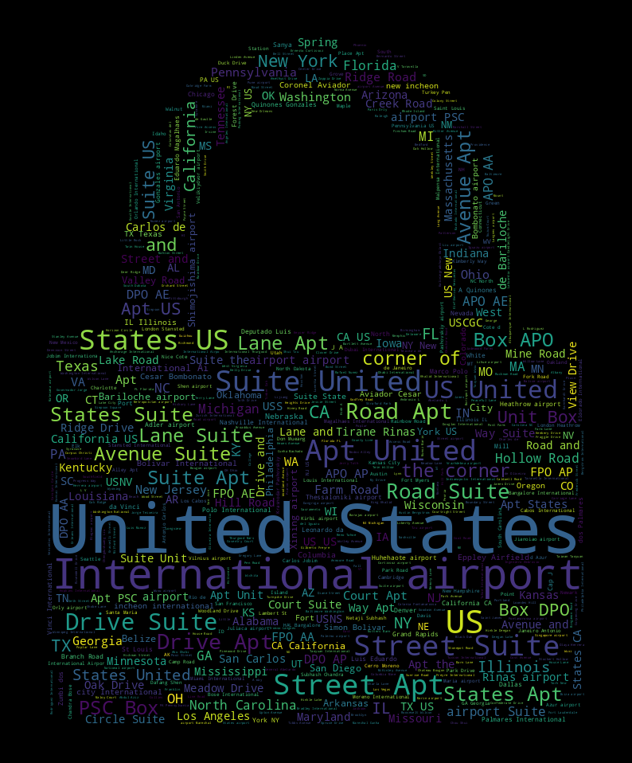
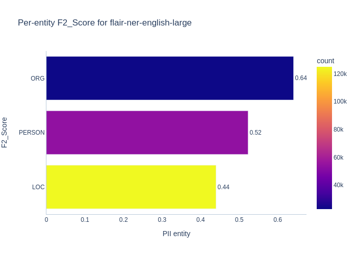
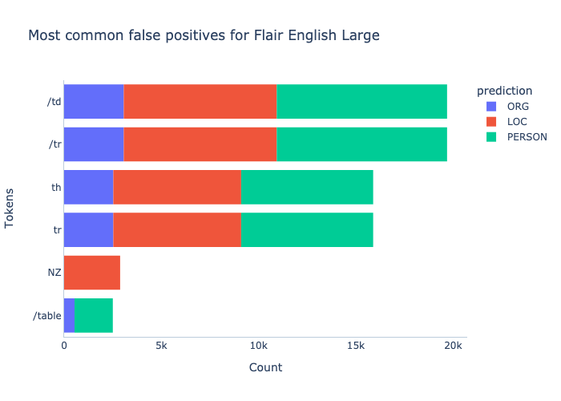
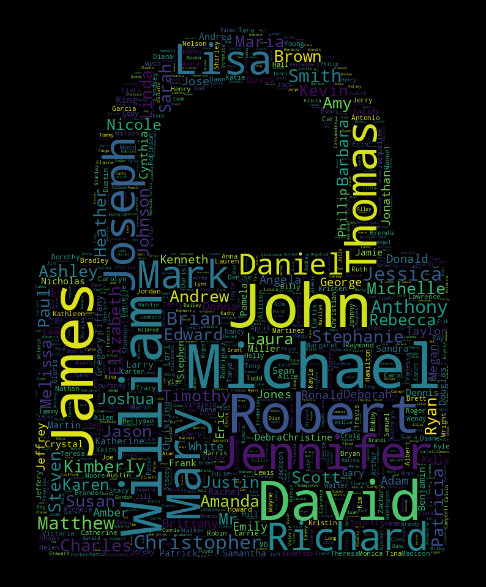
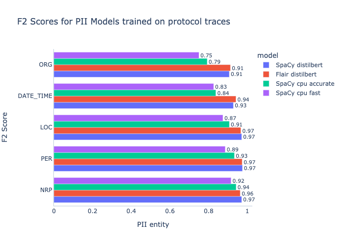
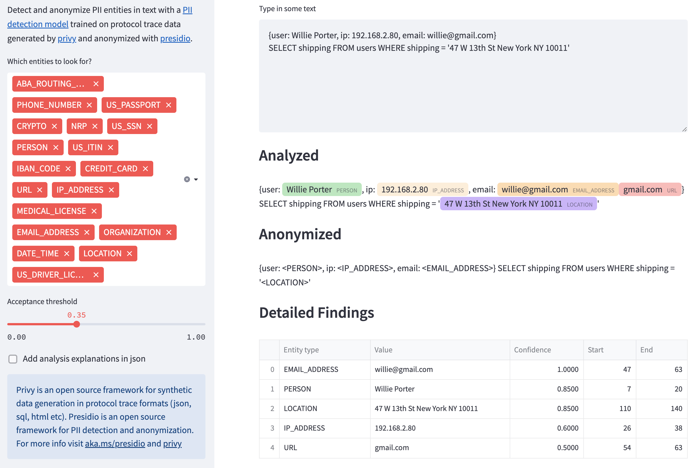

<alert severity="info">
This post introduces a<a href="https://detect.streamlitapp.com/" target="blank_"> PII detector for structured data</a>. Give it a try and <a href="https://github.com/pixie-io/pixie/issues/623" target="blank_">tell us what you think</a>. It uses a custom NLP model trained on a new PII dataset for protocol traces.
</alert>



It's 10 pm and you're on-call. A few minutes ago, you received a slack message about performance issues affecting users of your application. You sigh, pour yourself some instant coffee, and start pulling up the logs of your Kubernetes cluster. By chance, you peek at the latest HTTP request coming through - it's a purchase for foot cream. Not only that, but it has the customer's name, email, and IP address written all over it.

**"Ah," you think to yourself. "I probably shouldn't be seeing this."**

How often in your career have you muttered these words? With so much personal data flowing through applications, it can be all too easy to chance upon sensitive information while debugging issues. Some observability tools, like Pixie, enable users to [redact data sources they know to be sensitive](https://docs.px.dev/reference/admin/deploy-options/#setting-the-data-access-mode). Unfortunately, this solution drops entire categories of data, removing information that may be useful for debugging. To prevent privacy leaks while retaining useful information, developers need a system that finds and redacts only the sensitive parts of each data sample.

Recent breakthroughs in natural language processing (NLP) have made PII detection and redaction in unseen datasets feasible. In this blog post, I present:

- **[A new public PII dataset for structured data](#download-it-here!)**
- **[Privy, a synthetic PII data generator](#how-was-this-data-generated)**
- [**Benchmarks for off-the-shelf PII classifiers**](#benchmarking-existing-pii-classifiers)
- **[Custom PII classifiers for protocol trace data (SQL, JSON etc)](#custom-pii-classifier)**
- **[An interactive demo of a PII anonymizer](https://detect.streamlitapp.com/)**

## How do I redact PII with Pixie?

Pixie is an open source observability tool for Kubernetes applications that uses eBPF to automatically trace application requests, removing the need for manual instrumentation. Pixie supports a `PIIRestricted` data access mode that redacts a limited number of PII types (IPs, emails, MAC addresses, IMEI, credit cards, IBANs, and SSNs) using rule-based logic. **If you'd like to see a more advanced NLP-based PII detector added to Pixie, please [upvote this feature request](https://github.com/pixie-io/pixie/issues/623)!**

## Why care about sensitive data?

The costs of privacy violations have never been higher. Be it the EU's General Data Protection Regulation or California's California Consumer Privacy Act (CCPA), governments have enacted a flurry of new laws seeking to protect people's privacy by regulating the use of [Personally Identifiable Information (PII)](https://gdpr.eu/eu-gdpr-personal-data/). The GDPR alone charges up to [€20 million or 4% of annual global turnover](https://www.aparavi.com/resources-blog/data-compliance-fines-how-much-cost-you) (whichever is greater) for privacy violations. Despite such steep fines, compliance with these laws in the software industry has been spotty at best; privacy breaches abound and [companies are paying millions](https://www.tessian.com/blog/biggest-gdpr-fines-2020/) as a result.

## Use NLP to detect personally identifiable information (PII)

With recent advances in deep learning for text classification, developers have gained a promising new tool to detect sensitive data flows in their applications. [Transformer-based architectures](https://research.google/pubs/pub46201/) achieve remarkable accuracy for [Named Entity Recognition (NER) tasks](https://paperswithcode.com/sota/named-entity-recognition-ner-on-ontonotes-v5) in which models are trained to find geo-political entities, locations, and more in text samples.

### Why not use a rules based approach?

Rule based approaches (including regex) can be helpful for detecting pattern-based PII data such as social security numbers or bank accounts, but they struggle to identify PII that don’t follow clear patterns such as addresses or names, and can be overly sensitive to formatting. For a generalizable PII solution, it is often better to employ machine learning.

### How do we know it's working?

A machine learning system is only [as accurate as the data it's trained on](https://research.google/pubs/pub35179/). To have a good sense of how well a model performs, we need a dataset representative of the real life conditions it will be used in. In our case, we are looking for PII data a developer might encounter while debugging an application, including network data, logs, and protocol traces. Unfortunately, this data is not readily available - because PII is sensitive, public PII datasets are scarce. One option is to train on data leaks, though this data tends to be unlabelled, and is morally questionable to use. The labelled datasets that do exist (including 4-class [Conll](https://paperswithcode.com/dataset/conll-2003), and 18-class [OntoNotes](https://catalog.ldc.upenn.edu/LDC2013T19)) consist of news articles and telephone conversations instead of the debugging information we need.

## Introducing a new PII dataset

Due to the lack of public PII datasets for debugging information, I have generated a synthetic dataset that approximates real world data. **To my knowledge, this is the largest, public PII dataset currently available for structured data.** This new, labelled PII dataset consists of protocol traces (`JSON, SQL (PostgreSQL, MySQL), HTML, and XML`) generated from [OpenAPI specifications](https://swagger.io/specification/) and includes [60+ PII types](https://github.com/pixie-io/pixie/blob/main/src/datagen/pii/privy/privy/providers/english_us.py).

### Download it here!

The dataset is [publicly available on huggingface](https://huggingface.co/datasets/beki/privy). It contains token-wise labeled samples that can be used to train and evaluate sequence labelling models that detect the exact position of PII entities in text, as I will do [later in this article](#custom-pii-classifier).

```bash
# text, spans
{"full_text": "{first_name: Moustafa, sale_id: 235234}", "spans": "[{value: Moustafa, start: 14, end: 21, type: person}]"}
```

Each sample was generated from a unique template extracted from a public API.

```bash
# template
{"first_name": "{{person}}", "sale_id": "235234"}
```

A [BILUO](<https://en.wikipedia.org/wiki/Inside%E2%80%93outside%E2%80%93beginning_(tagging)>) tagged version of this dataset is also provided on huggingface for better compatibility with existing NER pipelines.

### How was this data generated?

This synthetic dataset was generated using [Privy](https://github.com/pixie-io/pixie/tree/main/src/datagen/pii/privy), a tool which parses [OpenAPI specifications](https://swagger.io/specification/) and generates synthetic request payloads, searching for keywords in API schema definitions to select appropriate data providers. Generated API payloads are converted to various protocol trace formats like `JSON` and `SQL` to approximate the data developers might encounter while debugging applications.

[Try it out for yourself](https://github.com/pixie-io/pixie/tree/main/src/datagen/pii/privy#quickstart) using a custom OpenAPI spec. By default, Privy draws from roughly 4000 descriptors stored in the [OpenAPI directory](https://github.com/APIs-guru/openapi-directory) to generate data, producing templates that can be used to generate a configurable number of unique data samples. Privy is language and region extensible, though it is currently configured to generate PII data in [English](https://github.com/pixie-io/pixie/blob/main/src/datagen/pii/privy/privy/providers/english_us.py) and [German](https://github.com/pixie-io/pixie/blob/main/src/datagen/pii/privy/privy/providers/german_de.py).



### How realistic is this data?

Great care was taken to provide highly realistic PII data providers. For instance, to generate organizations Privy draws from a list of 30,000 names I manually compiled from stock exchange listings and government directories. Other personal information like names and addresses can be obtained from the [Fake Name Generator](https://www.fakenamegenerator.com/) and loaded into Privy. Additionally, Privy implements custom generators for rule based PII data like passports, driver’s licenses, mac addresses, and more.

## Benchmarking existing PII classifiers

Now that we have a [synthetic PII dataset](https://huggingface.co/datasets/beki/privy), let’s run PII detection models on it! I have selected two popular off-the-shelf models to benchmark — [Presidio](https://microsoft.github.io/presidio/) (with a [Spacy NER backend](https://huggingface.co/spacy/en_core_web_lg)) and [Flair](https://huggingface.co/flair/ner-english-large). For fairness, I have filtered the dataset down to the PII types that each chosen model supports, removing unsupported entities. Here is a quick overview of the frameworks used:

[SpaCy](https://github.com/explosion/spaCy) is a popular NLP library with support for Named Entity Recognition.

[Presidio](https://microsoft.github.io/presidio/) is an open-source data protection and anonymization sdk developed by Microsoft. By default, it uses a Spacy NER model behind the scenes along with a set of custom PII detection logic.

[Flair](https://github.com/flairNLP/flair) is an NLP library built on PyTorch, featuring some new embedding techniques (Flair embeddings) and models that achieve state-of-the-art performance on common NER datasets.

### Label Conversions

Since the models surveyed use different labels for their entities, I had to translate PII annotations before passing the protocol trace dataset to them. See the diagram below for how I converted labels from one model architecture to the next.

<details closed>
<summary>PII label conversions</summary>


</details>

## Off-the-shelf Model Results

### How do we evaluate PII detectors?

Intuitively, we want to compute the accuracy of each model after it has classified PII entities in our synthetic dataset.


</img>

Just accuracy, however, won’t get us very far, because we also care about the kinds of mistakes our model makes. Given a text sample, there are four things that our model could do:

1. Correctly classify a PII entity (true positive)
2. Incorrectly classify text as PII (false positive)
3. Correctly classify a non-PII entity (true negative)
4. Incorrectly classify text as non-PII (false negative)

We can quantify the error rate of our model using **precision** and **recall**. Precision is the percentage of relevant results, while recall is the percentage of relevant results correctly classified.


</img>


</img>

When searching for PII we generally care more about catching true positives than we do about reducing false positives. That is why I will use **F2 scores** to evaluate our PII detection models. An F2 score is a single evaluation metric that takes both precision and recall into account. The **F2 score weights recall more highly than precision** - it places more emphasis on minimizing false negatives than it does on minimizing false positives.


</img>

No need to understand the full equation here - intuitively, the beta parameter allows us to specify how much more important recall is than precision. For our purposes, we will stick with a value of _β=2.5_. For more information and a complete derivation, see this [article on F-scores.](https://towardsdatascience.com/is-f1-the-appropriate-criterion-to-use-what-about-f2-f3-f-beta-4bd8ef17e285)

### Presidio Analyzer (SpaCy backend)

Let’s take a look at the F2 score for presidio’s PII detection system on our dataset. It is important to note that Presidio uses Spacy’s `en_core_web_lg` NER model under the hood by default to detect `PERSON`, `NRP` (nationalities, religious and political groups), `LOCATION`, and `DATE_TIME`. The remaining PII types are found with rule-based logic.



Overall, considering that Presidio was designed for and trained on free text (news articles, phone conversations etc.) it performs remarkably well on our protocol trace dataset. That said, it performs poorly for three entity types: `LOCATION`, `NRP` and `PERSON`. Why does presidio struggle here? Let's take a look at some of the most frequently misclassified tokens.



Looking at common false positives, we can see that presidio hones in on tokens like `type` `str` and `/td`, which are common in html and xml, likely because the model hasn’t seen this kind of protocol trace data before.

What about false negatives? Judging from the word cloud below, we can see that presidio struggles to identify common location-related keywords, probably because they are embedded in protocol trace data instead of the free text presidio is used to seeing.



### Flair

How is Flair different from Presidio Analyzer? For our purposes, the primary difference is that it supports one more PII entity out-of-the-box: `ORG` (organizations). I have benchmarked `flair-ner-english-large`, a NER model that uses [transformer embeddings](https://huggingface.co/xlm-roberta-large) and has entity labels similar to Privy.

We can see that Flair performs significantly better than presidio for `PERSON` and `LOC` while also reporting decent results for `ORG`.



Looking at the most common false positive tokens shows us that Flair, like Spacy, gets confused by html keywords like `/td` and `th`.



What about false negatives? From the word cloud below, we see that Flair struggles with a variety of names, likely because they are contained within protocol traces and not the free text this model was trained on.



## Custom PII Classifier

Can we do better than existing classifiers? Let’s train new models and benchmark them on the entities that existing NER models struggle most with in our dataset - `PERSON`, `LOCATION`, `ORGANIZATION`, `DATETIME` and `NRP`. I have chosen the following sequence labelling models to train:

- Flair transformer with [Distilbert](https://huggingface.co/distilbert-base-cased) embeddings
- SpaCy 3.4.1 transformer with [Distilbert](https://huggingface.co/distilbert-base-cased) embeddings
- SpaCy 3.4.1 [CNN](https://spacy.io/usage/training#quickstart) optimized for accuracy on CPU
- SpaCy 3.4.1 [CNN](https://spacy.io/usage/training#quickstart) optimized for efficiency on CPU

To improve data coverage, I have added three additional labelled datasets to my training data: [CONLL](https://www.clips.uantwerpen.be/conll2003/ner/) (news articles), [WikiGold](https://github.com/juand-r/entity-recognition-datasets/tree/master/data/wikigold/) (wikipedia text), and [OntoNotes](https://catalog.ldc.upenn.edu/LDC2013T19) (various genres of free text). Finally, to reduce training time, I have used only 20% of Privy’s synthetic dataset, which amounts to 120k unique samples. See the graph below for F2 scores on a test set pooled from all data sources.



## Redact and Anonymize (Demo)

Okay, so we’ve improved the PII identification element, but how do we actually redact PII from text? One way is to integrate our custom models with Presidio’s Anonymizer engine. This allows us to use Presidio’s rule-based classifiers for PII it excels at finding (phone numbers, emails etc.) while using our custom model to find the entities Presidio struggles with (`LOCATION` `PERSON`, `NRP`, `ORGANIZATION`).

Let’s see it in action.

<a href="https://detect.streamlitapp.com/" target="_blank">

</img>
</a>

Test it for yourself - this [PII anonymizer is hosted on streamlit](https://detect.streamlitapp.com/)!

## Inference Speed

Accuracy is all well and good, but how fast are these models? I have used Spacy’s [benchmarking project](https://github.com/explosion/projects/tree/v3/benchmarks/speed) to measure the average speed of each model in words per second (WPS). We can see that the Spacy model optimized for efficiency on CPU outperforms the rest. It also takes up only 7 MB of space.

| Library | Model                               | Link                                                                           | WPS CPU | WPS GPU | Size (MB) |
| ------- | ----------------------------------- | ------------------------------------------------------------------------------ | ------- | ------- | --------- |
| spaCy   | CNN optimized for efficiency on CPU | [en_spacy_pii_fast](https://huggingface.co/beki/en_spacy_pii_fast)             | 24,686  | 26,391  | 7         |
| spaCy   | CNN optimized for accuracy on CPU   | [en_spacy_pii_lg](https://huggingface.co/beki/en_spacy_pii_lg)                 | 4,501   | 6,669   | 608       |
| spaCy   | Transformer (Distillbert)           | [en_spacy_pii_distilbert](https://huggingface.co/beki/en_spacy_pii_distilbert) | 336     | 10,381  | 243       |
| Flair   | Transformer (Distillbert)           | [flair-pii-distilbert](https://huggingface.co/beki/flair-pii-distilbert)       | 74      | 944     | 783       |

## Where do we go from here?

The nice thing about machine learning is that when we improve the quality of our training data, we tend to improve the accuracy of our ML system regardless of what model architecture we use. As a result, improving the synthetic data generator is the best way to improve PII classifiers for protocol trace data. To achieve this, we could:

- Support additional protocol trace formats, like protobuf. Pixie currently supports a [number of protocol trace formats](https://docs.px.dev/about-pixie/data-sources/), but not all of them are generated by [Privy](https://github.com/pixie-io/pixie/tree/main/src/datagen/pii/privy/).
- Improve the realism of PII and non-PII data providers.
- Implement country specific data generators to support more languages and regions.

## About the Author

Benjamin Kilimnik is an undergraduate at Brown University. You can connect with him on [LinkedIn](http://www.linkedin.com/in/benkilimnik).
