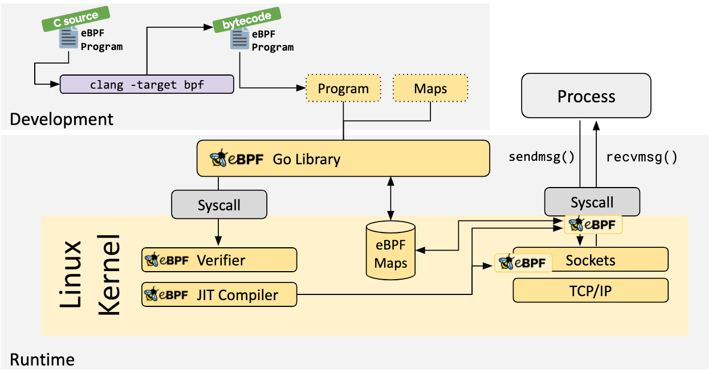
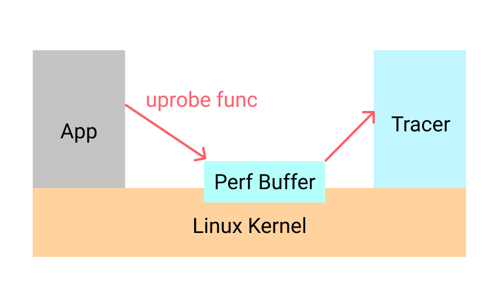
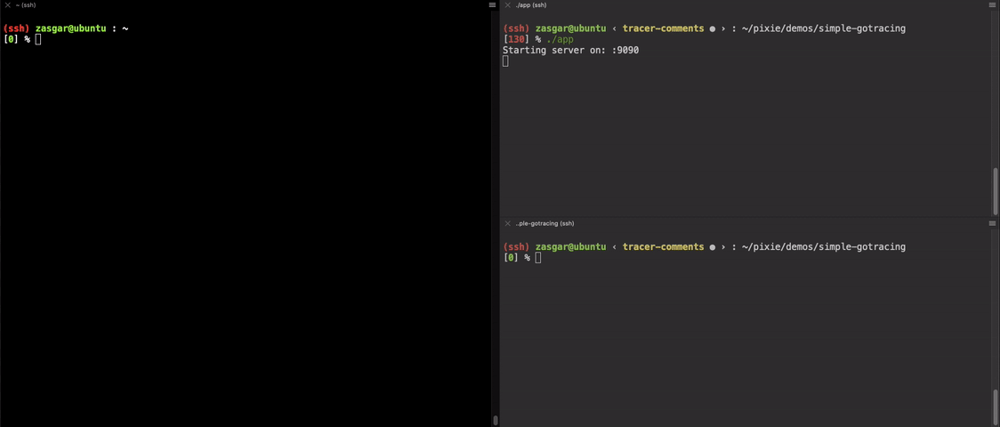

This post describes how to use [gobpf](https://github.com/iovisor/gobpf) and uprobes to build a function argument tracer for Go applications.

# Introduction

When debugging, we are typically interested in capturing the state of a program. This allows us to examine what the application is doing, and determine where the bug in our code is located. One of the
most simple things we can do is us a debugger to capture function arguments. For Go applications, we will typically use Delve or gdb. While these tools are amazing for debugging in a development environment, they usually do not lend themselves to be used in a production system. Some of the features that make these debuggers powerful also allow them to mutate the state of the application and
cause a significant overhead typically undesirable in a production system.

We will explore using enhanced BPF ([ebpf](https://ebpf.io)), which is available in Linux 4.x+, and the higher level Go library gobpf to capture function arguments. Using eBPF has its own sets of pros and cons, and will explore that as part of the implementation.

# What is eBPF?

Enhanced BPF (eBPF) is a kernel technology that is available in Linux 4.x+. You can think about it as a lightweight sandboxed VM that runs inside of the Linux kernel and provides access to various kernel facilities. As shown in the overview below, eBPF allows the kernel to run verified restricted C code. The C code is first compiled to the BPF bytecode using Clang, then the bytecode is verified to make sure it's safe to execute. Since this verification is strict and only support a verifiable subset of C, the kernel can then compile the bytecode to verified machine code for efficient runtime execution. This high performance allows eBPF to be used in performance-critical workloads like packet filtering, networking monitoring, etc. Using eBPF, we can also insert probes; functions that are executed whenever a specific event such as a function call occurs. The probes then allow you to run a BPF compiled function that can examine the state of the system application or kernel. Many different types of probes are available, but the one we will focus on for this post is uprobes.

::: div image-l

:::


# Uprobes

One of the features that BPF allows you to access is uprobes. These functions will enable you to intercept a userspace program by inserting a soft-interrupt debug trap instruction (_int3_ on an x86). If you are interested in details, check out [this](https://eli.thegreenplace.net/2011/01/27/how-debuggers-work-part-2-breakpoints) blog post by Eli. The flow for an uprobe is essentially the same as any other BPF program and summarized in the diagram below. The compiled and verified BPF program is executed as part of an uprobe, and the results can be written into a buffer. Let's see how uprobes actually function.


::: div image-l

:::

To dig into the details of deploying uprobes and capturing function arguments, we will be using [this](https://github.com/pixie-labs/pixie/blob/main/demos/simple-gotracing/app.go) simple demo application. The relevant parts of this Go program are shown below. It's a simple HTTP server that exposes a single _GET_ endpoint on _/e_, which computes Euler's number (__e__). This uses an iterative approximation. It takes in a single query param(_iters_), which specifies the number of iterations to run the approximation. The more iterations, the more accurate the approximation, at the cost of compute cycles. It's not essential to understand the math behind the function. We are just interested in tracing the arguments of any invocation of _computeE_.

```go
// computeE computes the approximation of e by running a fixed number of iterations.
func computeE(iterations int64) float64 {
	res := 2.0
	fact := 1.0

	for i := int64(2); i < iterations; i++ {
		fact *= float64(i)
		res += 1 / fact
	}
	return res
}

func main() {
	http.HandleFunc("/e", func(w http.ResponseWriter, r *http.Request) {
        /// Parse iters argument from get request, use default if not available.
        // ... removed for brevity ...
		w.Write([]byte(fmt.Sprintf("e = %0.4f\n", computeE(iters))))
	})
    // Start server...
}
```
To understand how uprobes work, let's look at how symbols are tracked inside binaries. Go binaries on Linux use DWARF to store debug info. This information is available, even in optimized binaries, unless debug data has been stripped. We can use the command _objdump_ to examine the symbols in the binary:

```bash
[0] % objdump --syms app|grep computeE
00000000006609a0 g     F .text    000000000000004b              main.computeE
```

The function _computeE_ is located at address _0x6609a0_. To look at the instructions around it, we can ask objdump to disassemble to binary (done by adding -d). The disassembled code looks like:

```bash
[0] % objdump -d app | less
00000000006609a0 <main.computeE>:
  6609a0:       48 8b 44 24 08          mov    0x8(%rsp),%rax
  6609a5:       b9 02 00 00 00          mov    $0x2,%ecx
  6609aa:       f2 0f 10 05 16 a6 0f    movsd  0xfa616(%rip),%xmm0
  6609b1:       00
  6609b2:       f2 0f 10 0d 36 a6 0f    movsd  0xfa636(%rip),%xmm1
```

From this we can see what happens when _computeE_ is called. The first instruction is `mov 0x8(%rsp),%rax`, moves the content offset `0x8` from the `rsp` register to the `rax` register. This is actually the input argument _iterations_ above; Go's arguments are passed on the stack. With this information in mind, we are ready to dive in and start writing the code to trace the arguments for _computeE_.

# Building the Tracer

To capture the events, we need to register an uprobe function and have a userspace function that can read the output. A diagram of this is shown below. We will write a binary called _tracer_ that is responsible for registering the BPF code and reading the results of the BPF code. As shown, the uprobe will simply write to a perf-buffer, a linux kernel data structure used for perf events.

::: div image-m

:::

Now that we understand the pieces involved, let's look into the details of what happens when we add an uprobe. The diagram below shows how the binary is modified by the Linux kernel with an uprobe. The soft-interrupt instruction (_int3_) is inserted as the first instruction in `main.computeE`. This will cause a soft-interrupt, allowing the Linux kernel to execute our BPF function. We can write the arguments to the perf-buffer, which is asynchronously read by the tracer.

::: div image-xl

:::

The BPF function for this is relatively simple; the C code is shown below. We will register this function so that it's invoked every time _main.computeE_ is called. When it's called, we simply read the function argument and write that the perf buffer. There is lots of boilerplate to set up the buffers, etc., this can be found in the complete example [here](https://github.com/pixie-labs/pixie/blob/main/demos/simple-gotracing/tracer/tracer.go).

```c
#include <uapi/linux/ptrace.h>

BPF_PERF_OUTPUT(trace);

inline int computeECalled(struct pt_regs *ctx) {
  // The input argument is stored in ax.
  long val = ctx->ax;
  trace.perf_submit(ctx, &val, sizeof(val));
  return 0;
}
```

With that, we have a fully functioning end-to-end argument tracer for the _main.computeE_ function! The results of this are shown in the video clip below.

::: div image-xl

:::

One of the cool things is that we can actually use GDB to see the modifications made to the binary. Here we dump out the instructions at the _0x6609a0_ address, before running our tracer binary.

```
(gdb) display /4i 0x6609a0
10: x/4i 0x6609a0
   0x6609a0 <main.computeE>:    mov    0x8(%rsp),%rax
   0x6609a5 <main.computeE+5>:  mov    $0x2,%ecx
   0x6609aa <main.computeE+10>: movsd  0xfa616(%rip),%xmm0
   0x6609b2 <main.computeE+18>: movsd  0xfa636(%rip),%xmm1
```

Here it is after we run the tracer binary. We can clearly see that the first instruction is now _int3_.

```
(gdb) display /4i 0x6609a0
7: x/4i 0x6609a0
   0x6609a0 <main.computeE>:    int3
   0x6609a1 <main.computeE+1>:  mov    0x8(%rsp),%eax
   0x6609a5 <main.computeE+5>:  mov    $0x2,%ecx
   0x6609aa <main.computeE+10>: movsd  0xfa616(%rip),%xmm0
```

Although we hardcoded the tracer for this particular example, it's possible to make this process generalizable. Many aspects of Go, such as nested pointers, interfaces, channels, etc. make this process challenging, but solving these problems allows for another instrumentation mode not available in existing systems. Also, since this process works at the binary level, it can be used with natively compiled binaries for other languages (C++, Rust, etc.). We just need to account for the differences in their respective ABI's.

# So is this a good idea?

BPF tracing using uprobes comes with its own set of pros and cons. It's attractive to use this when we need observability into the binary state, even when running in environments where attaching a debugger will be problematic or harmful (ex. production binaries). The biggest downside is the code required to get even trivial visibility into the application state. While BPF code is relatively accessible, it's complex to write and maintain. Without substantial high-level tooling, it's unlikely this can be used for generic debugging.

Go dynamic logging is something we are working on at Pixie, so if this post's contents are interesting, please give [Pixie](https://pixielabs.ai) a try. If you like working on challenges like this, consider working at [Pixie](https://pixielabs.ai/career).
