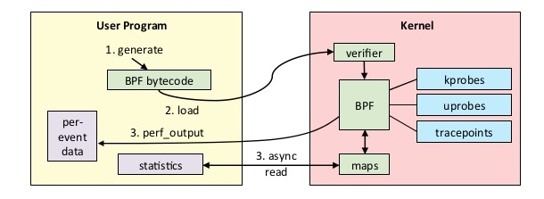

This is the first in a series of posts describing how we can debug applications in production using eBPF, without recompilation/redeployment. This post describes how to use [gobpf](https://github.com/iovisor/gobpf) and uprobes to build a function argument tracer for Go applications. This technique is also extendable to other compiled languages such as C++, Rust, etc. The next sets of posts in this series will discuss using eBPF for tracing HTTP/gRPC data, SSL, etc.

# Introduction

When debugging, we are typically interested in capturing the state of a program. This allows us to examine what the application is doing and determine where the bug is located in our code. A simple way to observe state is to use a debugger to capture function arguments. For Go applications, we often use Delve or gdb.

Delve and gdb work well for debugging in a development environment, but they are not often used in production. The features that make these debuggers powerful can also make them undesirable to use in production systems. Debuggers can cause significant interruption to the program and even allow mutation of state which might lead to unexpected failures of production software.

To more cleanly capture function arguments, we will explore using enhanced BPF ([eBPF](https://ebpf.io)), which is available in Linux 4.x+, and the higher level Go library [gobpf](https://github.com/iovisor/gobpf).

# What is eBPF?

Extended BPF (eBPF) is a kernel technology that is available in Linux 4.x+. You can think of it as a lightweight sandboxed VM that runs inside of the Linux kernel and can provide verified access to kernel memory.

As shown in the overview below, eBPF allows the kernel to run BPF bytecode. While the front-end language used can vary, it is often a restricted subset of C. Typically the C code is first compiled to the BPF bytecode using Clang, then the bytecode is verified to make sure it's safe to execute. These strict verifications guarantee that the machine code will not intentionally or accidentally compromise the Linux kernel, and that the BPF probe will execute in a bounded number of instructions every time it is triggered. These guarantees enable eBPF to be used in performance-critical workloads like packet filtering, networking monitoring, etc.

Functionally, eBPF allows you to run restricted C code upon some event (eg. timer, network event or a function call). When triggered on a function call we call these functions probes and they can be used to either run on a function call within the kernel (kprobes), or a function call in a userspace program (uprobes). This post focuses on using uprobes to allow dynamic tracing of function arguments.

# Uprobes

Uprobes allow you to intercept a userspace program by inserting a debug trap instruction (`int3` on an x86) that triggers a soft-interrupt . This is also [how debuggers work](https://eli.thegreenplace.net/2011/01/27/how-debuggers-work-part-2-breakpoints). The flow for an uprobe is essentially the same as any other BPF program and is summarized in the diagram below. The compiled and verified BPF program is executed as part of a uprobe, and the results can be written into a buffer.


::: div image-l

:::

Let's see how uprobes actually function. To deploy uprobes and capture function arguments, we will be using [this](https://github.com/pixie-labs/pixie/blob/main/demos/simple-gotracing/app.go) simple demo application. The relevant parts of this Go program are shown below.

`main()` is a simple HTTP server that exposes a single _GET_ endpoint on _/e_, which computes Euler's number (__e__) using an iterative approximation. `computeE` takes in a single query param(_iters_), which specifies the number of iterations to run for the approximation. The more iterations, the more accurate the approximation, at the cost of compute cycles. It's not essential to understand the math behind the function. We are just interested in tracing the arguments of any invocation of `computeE`.

```go:numbers
// computeE computes the approximation of e by running a fixed number of iterations.
func computeE(iterations int64) float64 {
  res := 2.0
  fact := 1.0

  for i := int64(2); i < iterations; i++ {
    fact *= float64(i)
    res += 1 / fact
  }
  return res
}

func main() {
  http.HandleFunc("/e", func(w http.ResponseWriter, r *http.Request) {
    // Parse iters argument from get request, use default if not available.
    // ... removed for brevity ...
    w.Write([]byte(fmt.Sprintf("e = %0.4f\n", computeE(iters))))
  })
  // Start server...
}
```
To understand how uprobes work, let's look at how symbols are tracked inside binaries. Since uprobes work by inserting a debug trap instruction, we need to get the address where the function is located. Go binaries on Linux use ELF to store debug info. This information is available, even in optimized binaries, unless debug data has been stripped. We can use the command `objdump` to examine the symbols in the binary:

```bash:numbers
[0] % objdump --syms app|grep computeE
00000000006609a0 g     F .text    000000000000004b              main.computeE
```

From the output, we know that the function `computeE` is located at address `0x6609a0`. To look at the instructions around it, we can ask `objdump` to disassemble to binary (done by adding `-d`). The disassembled code looks like:

```bash:numbers
[0] % objdump -d app | less
00000000006609a0 <main.computeE>:
  6609a0:       48 8b 44 24 08          mov    0x8(%rsp),%rax
  6609a5:       b9 02 00 00 00          mov    $0x2,%ecx
  6609aa:       f2 0f 10 05 16 a6 0f    movsd  0xfa616(%rip),%xmm0
  6609b1:       00
  6609b2:       f2 0f 10 0d 36 a6 0f    movsd  0xfa636(%rip),%xmm1
```

From this we can see what happens when `computeE` is called. The first instruction is `mov 0x8(%rsp),%rax`. This moves the content offset `0x8` from the `rsp` register to the `rax` register. This is actually the input argument `iterations` above; Go's arguments are passed on the stack.

With this information in mind, we are now ready to dive in and write code to trace the arguments for `computeE`.

# Building the Tracer

To capture the events, we need to register a uprobe function and have a userspace function that can read the output. A diagram of this is shown below. We will write a binary called `tracer` that is responsible for registering the BPF code and reading the results of the BPF code. As shown, the uprobe will simply write to a perf-buffer, a linux kernel data structure used for perf events.

::: div image-m
<svg title='High-level overview showing the Tracer binary listening to perf events generated from the App' src='app-tracer.svg' />
:::

Now that we understand the pieces involved, let's look into the details of what happens when we add an uprobe. The diagram below shows how the binary is modified by the Linux kernel with an uprobe. The soft-interrupt instruction (`int3`) is inserted as the first instruction in `main.computeE`. This causes a soft-interrupt, allowing the Linux kernel to execute our BPF function. We then write the arguments to the perf-buffer, which is asynchronously read by the tracer.

::: div image-xl
<svg title='Details of how a debug trap instruction is used call a BPF program' src='app-trace.svg' />
:::

The BPF function for this is relatively simple; the C code is shown below. We register this function so that it's invoked every time `main.computeE` is called. Once it's called, we simply read the function argument and write that the perf buffer. Lots of boilerplate is required to set up the buffers, etc. and this can be found in the complete example [here](https://github.com/pixie-labs/pixie/blob/main/demos/simple-gotracing/trace_example/trace.go).

```c:numbers
#include <uapi/linux/ptrace.h>

BPF_PERF_OUTPUT(trace);

inline int computeECalled(struct pt_regs *ctx) {
  // The input argument is stored in ax.
  long val = ctx->ax;
  trace.perf_submit(ctx, &val, sizeof(val));
  return 0;
}
```

Now we have a fully functioning end-to-end argument tracer for the `main.computeE` function! The results of this are shown in the video clip below.

::: div image-xl
<svg title='End-to-End demo'  src='e2e-demo.gif' />
:::

One of the cool things is that we can actually use GDB to see the modifications made to the binary. Here we dump out the instructions at the `0x6609a0` address, before running our tracer binary.

```bash:numbers
(gdb) display /4i 0x6609a0
10: x/4i 0x6609a0
   0x6609a0 <main.computeE>:    mov    0x8(%rsp),%rax
   0x6609a5 <main.computeE+5>:  mov    $0x2,%ecx
   0x6609aa <main.computeE+10>: movsd  0xfa616(%rip),%xmm0
   0x6609b2 <main.computeE+18>: movsd  0xfa636(%rip),%xmm1
```

Here it is after we run the tracer binary. We can clearly see that the first instruction is now `int3`.

```bash::numbers
(gdb) display /4i 0x6609a0
7: x/4i 0x6609a0
   0x6609a0 <main.computeE>:    int3
   0x6609a1 <main.computeE+1>:  mov    0x8(%rsp),%eax
   0x6609a5 <main.computeE+5>:  mov    $0x2,%ecx
   0x6609aa <main.computeE+10>: movsd  0xfa616(%rip),%xmm0
```

Although we hardcoded the tracer for this particular example, it's possible to make this process generalizable. Many aspects of Go, such as nested pointers, interfaces, channels, etc. make this process challenging, but solving these problems allows for another instrumentation mode not available in existing systems. Also, since this process works at the binary level, it can be used with natively compiled binaries for other languages (C++, Rust, etc.). We just need to account for the differences in their respective ABI's.

# What's next?

BPF tracing using uprobes comes with its own set of pros and cons. It's beneficial to use BPF when we need observability into the binary state, even when running in environments where attaching a debugger will be problematic or harmful (ex. production binaries). The biggest downside is the code required to get even trivial visibility into the application state. While BPF code is relatively accessible, it's complex to write and maintain. Without substantial high-level tooling, it's unlikely this can be used for generic debugging.

::: div image-xs
<svg src="wavingnaut.svg" width="40px" />
:::

Go dynamic logging is something we are working on at Pixie. If this post's contents are interesting, please give [Pixie](https://pixielabs.ai) a try, or check out our [open positions](https://pixielabs.ai/career).


## References

* [iovisor/gobpf](https://github.com/iovisor/gobpf)
* [iovisor/bcc](https://github.com/iovisor/bcc)
* GoPoland Meetup [Video](https://www.youtube.com/watch?v=SlcBq3xDc7I) + [Slides](https://www.slideshare.net/ZainAsgar/go-logging-using-ebpf)
* GoBangalore Meetup [Video](https://www.youtube.com/watch?v=0mxUU_--dDM&feature=youtu.be). Checkout Below:

<iframe width="560" height="315" src="https://www.youtube.com/embed/0mxUU_--dDM?start=15" frameborder="0" allow="accelerometer; autoplay; clipboard-write; encrypted-media; gyroscope; picture-in-picture" allowfullscreen></iframe>
