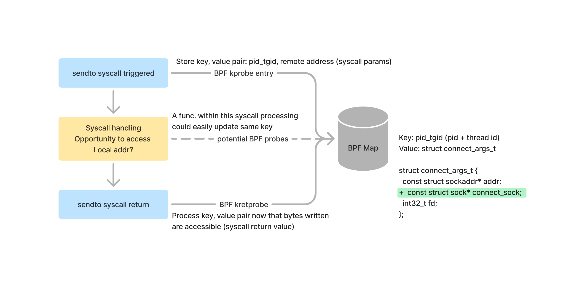

eBPF's ability to reprogram the kernel for networking, observability and security use cases is an incredible super power, however, to start using the technology you must first understand how and where to hook into the Linux kernel. The technology provides the means for tapping into almost any part of the kernel, but this flexibility comes at a cost – applying it to a new area is daunting if you aren't comfortable navigating the Linux source / kernel APIs.

Many eBPF resources available today explore how to write eBPF programs for well known hooks (syscalls, XDP, etc) and leave future application up to the reader. While learning to write a program is half the battle, you can't start writing a program without first knowing where to attach and the data structures available to the attachment point. Therefore choosing the correct probe is crucial for solving novel challenges and can even help avoid complexity and unstable APIs.

In this post, we will explore strategies to inspect the Linux source to write eBPF programs. These tactics will provide the necessary skills for fearlessly navigating Linux and were recently employed to supplement [Pixie's](https://px.dev) protocol traces with a socket's local address ([pixie#1989](https://github.com/pixie-io/pixie/pull/1989)).

## Introduction to ftrace: the Linux function tracer

Ftrace is a function tracer for Linux. While it has evolved into a suite of tracing utilities, for our purposes it can be thought of as a means for tracing the entry and exit of any function[^1] within Linux. This dynamic tracing is supported by nop instructions added to the start of every kernel function. When tracing is disabled, these nops are left in place and the kernel remains performant. When tracing is requested, ftrace transforms these nops into instructions that record the function call graph (see the [appendix](#ftrace-deep-dive) for a talk with more details).

While ftrace's primary interface is through the /sys/kernel/debug/tracing directory, it's often more convenient to use a ftrace frontend such as [trace-cmd](https://man7.org/linux/man-pages/man1/trace-cmd.1.html). Trace-cmd makes it easy to craft one-liners for adhoc tracing, so it's better suited for our use case. The typical workflow consists of recording a trace ([trace-cmd record](https://man7.org/linux/man-pages/man1/trace-cmd-record.1.html)) followed by a command to inspect the trace file ([trace-cmd report](https://man7.org/linux/man-pages/man1/trace-cmd-report.1.html)).

Ftrace provides a wealth of configuration options. For identifying where to add eBPF programs, we won't look into these possibilities, but I recommend checking out the [kernel documentation and other ftrace resources](#ftrace-resources) for more details.

[^1]: Inline functions won't show up in this tracing. In these cases, the closest non-inlined parent function could be used.

## Capturing a socket's local address via eBPF

[Pixie](https://px.dev) is an observability tool for K8s that provides protocol traces (request/response spans) between your microservices. Pixie captures these spans via eBPF hooks on socket syscalls. One of the gaps in this tracing was that the local address of the connection (IP and port) was missing. With this detail in mind, let's explore how ftrace can identify the correct function to probe to capture this information.

The socket syscall APIs provide easy access to the remote details of a connection. Since eBPF can inspect the arguments of a kernel function, these are readily accessible and how Pixie tracks the remote side of the connection. Unfortunately, the local side of the connection is referenced through the socket file descriptor. There are user space APIs to inspect the fd ([getsockname](https://man7.org/linux/man-pages/man2/getsockname.2.html), netlink [sock_diag](https://www.man7.org/linux/man-pages/man7/sock_diag.7.html)), but there isn't an equivalent interface available to BPF's restricted environment.

::: div image-xl
<figure>
  <pre>
    ssize_t sendto(int sockfd, const void buf[.len], size_t len, int flags,<br/>
&nbsp;             const <b>struct sockaddr *dest_addr</b>, socklen_t addrlen);<br/><br/>
    
    int connect(int sockfd, const <b>struct sockaddr *addr</b>, socklen_t addrlen);<br/><br/>
    
    ssize_t sendmsg(int sockfd, const struct msghdr *<b>msg</b>, int flags);<br/>
    # <b>msg->msg_name</b> contains the struct sockaddr
  </pre>
  <figcaption>Various linux socket syscall functions with the parameter highlighted that stores the remote side of the connection.</figcaption>

</figure>
:::

The beginning of the investigation started with running a curl command under ftrace's function graph tracer. This provides all the kernel functions that service this command and are potential candidates for intercepting the local address and port. The following invocation only enables ftrace for the curl command (`-F` argument), so any kernel handling for other processes is already filtered out.

```bash
sudo trace-cmd record -F -p function_graph curl http://google.com
```

Since the kernel performs many complex operations on our behalf, the resulting trace needs to be filtered to the socket handling. To do this, we need to first filter the traces to the syscalls. They can be identified by searching for any functions with a __x64_sys_ prefix as seen below:

```bash
curl-965264 [003] 856720.850841: funcgraph_entry:                   |  __x64_sys_sendto() {
curl-965264 [003] 856720.850841: funcgraph_entry:                   |    x64_sys_call() {
curl-965264 [003] 856720.850841: funcgraph_entry:                   |      __sys_sendto() {
curl-965264 [003] 856720.850842: funcgraph_entry:                   |        sockfd_lookup_light() {
curl-965264 [003] 856720.850842: funcgraph_entry:        0.301 us   |          __fdget();
curl-965264 [003] 856720.850843: funcgraph_exit:         0.794 us   |        }
curl-965264 [003] 856720.850843: funcgraph_entry:                   |        security_socket_sendmsg() {
curl-965264 [003] 856720.850843: funcgraph_entry:                   |          apparmor_socket_sendmsg() {
curl-965264 [003] 856720.850843: funcgraph_entry:                   |            aa_inet_msg_perm() {
curl-965264 [003] 856720.850844: funcgraph_entry:                   |              __cond_resched() {
curl-965264 [003] 856720.850844: funcgraph_entry:        0.267 us   |                rcu_all_qs();
curl-965264 [003] 856720.850844: funcgraph_exit:         0.736 us   |              }
curl-965264 [003] 856720.850845: funcgraph_exit:         1.276 us   |            }
curl-965264 [003] 856720.850845: funcgraph_exit:         1.793 us   |          }
curl-965264 [003] 856720.850845: funcgraph_exit:         2.326 us   |        }
```

From here, we started to investigate the child functions of the socket send syscalls (`sendto`, `sendmsg`, `sendmmsg`). Since these syscalls comprise a complete transmission to the socket, additional state management can be avoided if a child function is probed. For example, it might be possible to capture the local address from the [socket](https://man7.org/linux/man-pages/man2/socket.2.html) syscall, however, this could be complex to implement correctly. Web servers are known to have pre-forking threading models that issue the `socket` and `sendto`/`sendmsg`/`sendmmsg` syscalls from different threads. While this architecture isn't well known for clients, capturing the data from within a single syscall limits any potential unknowns.

::: div image-xl
<figure>
  
</figure>
:::

As we uncovered relevant functions, they were cross referenced with https://elixir.bootlin.com/ to identify if a function was viable. An ideal function should have a socket data structure as an argument or return value (interface eBPF can access) and be a stable kernel interface. After looking through a variety of options, `tcp_v4_connect` and `tcp_v6_connect` appeared to be the clear winners. These functions' first argument contained a sock struct that contains the local address. From a stability standpoint, these functions were defined within the [tcp_prot](https://elixir.bootlin.com/linux/v4.14.336/source/net/ipv4/tcp_ipv4.c#L2426) and [tcpv6_prot](https://elixir.bootlin.com/linux/v4.14.336/source/net/ipv6/tcp_ipv6.c#L1945) structs. In C programming, it's common to define an OOP like interface with a struct that contains function pointers – meaning these functions are more likely to be stable than a random kernel function. Checking this function prototype across different kernel versions validated that assumption.

From our past experience working on these socket tracing use cases, we knew that this one function wouldn't be enough. The curl command we inspected creates a new TCP connection, but what about connections that are picked up mid stream (long lived TCP connections)?

Armed with the process for investigating these kernel functions, let's re-apply this to an in flight connection.

To simulate this, `netcat` was used for the server side and `telnet` for the client side. Ftrace was attached after telnet was connected to limit tracing to the message sending.

```bash
(term1) $ nc -l 8000 -v & 
(term1) $ telnet localhost 8000
Trying 127.0.0.1...
Connected to localhost.
Escape character is '^]'.

(term2) sudo trace-cmd record -P ${pid_of_telnet} -p function_graph

# tcp_v4_connect was missed as expected
(term2) sudo trace-cmd report | grep tcp_v4_connect

(term2) sudo trace-cmd report | grep tcp_sendmsg
   telnet-1554313 [004] 1183569.050034: funcgraph_entry: | tcp_sendmsg() {
```

After reviewing the trace report, the `tcp_sendmsg` function was identified. This function also exists within the `tcp_prot` and `tcpv6_prot`, which bolsters our confidence in its stability. With the new connection and mid stream cases covered, this concluded the investigation for capturing the local address!

[20 lines](https://github.com/pixie-io/pixie/pull/1989/files#diff-7c17eaf9b79a6d1a8ad7d883d78c36e8bda6db91a67c135ea7765a2b8f8a51d1R608) of eBPF code later and Pixie was able to capture the local address of tcp sockets! While the change itself was small, understanding the kernel's TCP state machine and navigating the source with ftrace was crucial for the implementation. We've found ftrace to be an invaluable tool for eBPF programming and recommend that you add it to your toolbelt!

## Appendix

### Ftrace Resources

- [ftrace: trace your kernel functions!](https://jvns.ca/blog/2017/03/19/getting-started-with-ftrace/) (March 2017, Julia Evans)
- [trace-cmd: A front-end for Ftrace](https://lwn.net/Articles/410200/) (Oct 2010, Steven Rostedt)
- [Debugging the kernel using Ftrace - part 1](https://lwn.net/Articles/365835/) (Dec 2009, Steven Rostedt)
- [Debugging the kernel using Ftrace - part 2](https://lwn.net/Articles/366796/) (Dec 2009, Steven Rostedt)
- [Kernel documentation](https://www.kernel.org/doc/html/v4.17/trace/ftrace.html)

### Ftrace Deep Dive

[Understanding the Linux kernel via Ftrace](https://www.youtube.com/watch?v=2ff-7UTg5rE) - (2017, Steven Rostedt)
