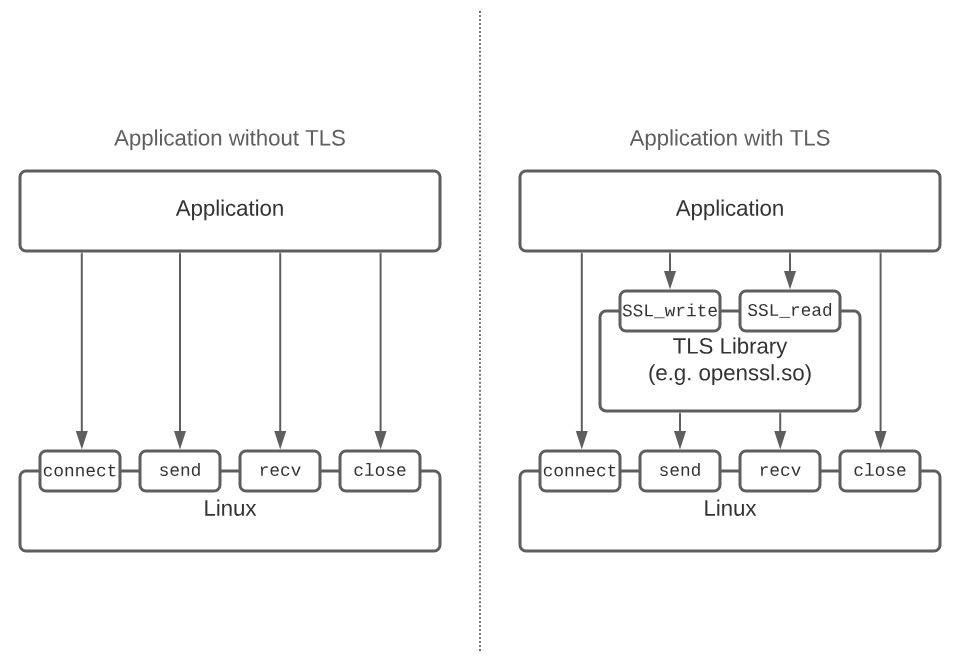
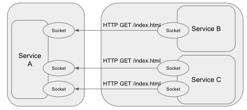
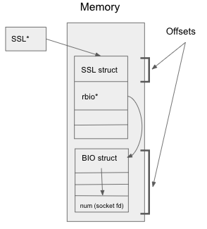
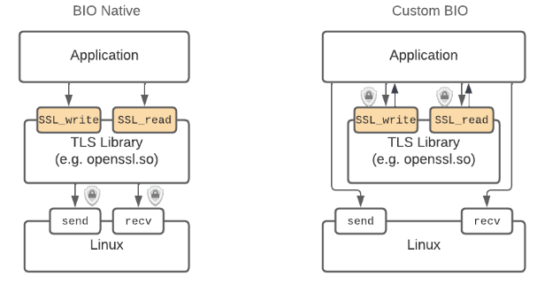
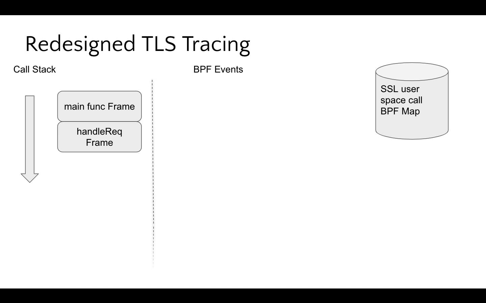
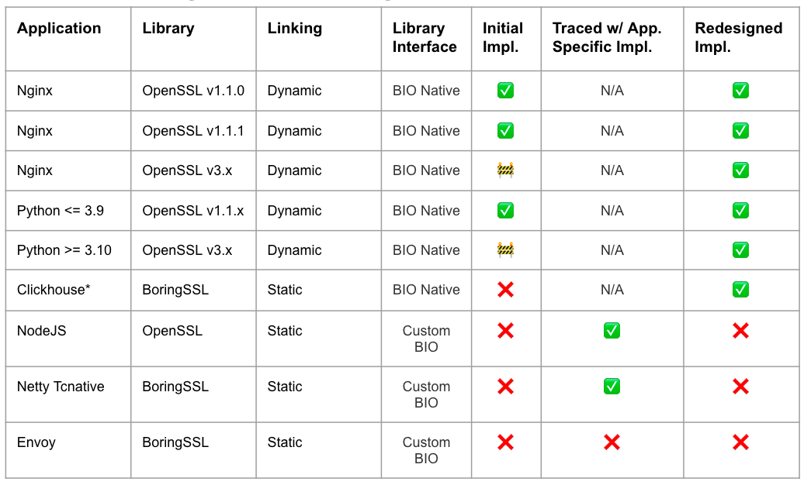

Instrumentation free, eBPF based tools such as [DeepFlow](https://deepflow.io) and [Pixie](https://px.dev) aim to provide broad observability coverage out of the box. By leveraging eBPF[^1], these tools inspect all network traffic by hooking into Linux's network stack (syscalls). The prevalence of TLS and encrypted traffic obscures this global view and necessitates probing applications higher in the software stack (at the TLS library layer) to regain access to the plaintext data. This moves the eBPF instrumentation from stable kernel syscalls to unstable user space interfaces (TLS libraries, application binaries, etc). In this post, we will walk through the TLS tracing tactics used by open source projects, how they've evolved to address these unstable user space library interfaces and where the future is headed.

[^1]: For an intro to eBPF and an end to end example of working with TLS see this [blog post](https://blog.px.dev/ebpf-openssl-tracing/).

## Tracing TLS: An overview

Applications often use a library to implement TLS to leverage a battle tested cryptography implementation. These libraries typically have a function for encrypting (`SSL_write`) and decrypting data (`SSL_read`). This API boundary is an ideal place to intercept the payload since it's just before/after it is encrypted/decrypted. The diagram below shows the high level difference between an application with and without TLS.

::: div image-xl
<figure>
  
</figure>
:::

Despite TLS libraries exposing a similar API, differences between libraries, the linking style (dynamic or static) and use of the library create challenges when probing this layer. For example, BoringSSL is almost always statically linked, while OpenSSL could be linked dynamically or statically (most commonly dynamically linked). This means that the symbols the eBPF program needs to attach to could be contained within the application binary itself or within a shared library. Once the right attachment point is identified, the tracing can access the plaintext request and response payload.

## Reconstructing spans from the network payload

For observability tools that pioneered this tracing, one of their primary goals is to recreate the spans between services. This means that it's not enough to just have access to the plaintext. Each payload needs to be associated with the source and destination service in addition to the connection it belongs to. This adds an additional requirement on top of the library in use, type of linking and usage differences.

::: div image-xl
<figure>
  
</figure>
:::

Using the OpenSSL API as an example, the `SSL_write` and `SSL_read` functions both accept a `SSL` struct. Similar to how the kernel's `send`/`recv` syscalls require a socket file descriptor, this structure contains information that uniquely identifies the connection and usually includes a socket file descriptor. As we'll see, this is commonly used in TLS tracing implementations.

```
     int SSL_write(SSL *ssl, const void *plaintext, int num);
 
     typedef struct ssl_st SSL;
     typedef struct bio_st BIO;

     struct ssl_st {
         BIO *rbio;
         BIO *wbio;
         [ … ]
     }
     struct bio_st {
         int num;      <-----   Stores the socket file descriptor
     }
```

## The Past: Memory offset dependent probes

Pixie and other eBPF solutions initially relied on navigating the `SSL*` struct from above. As mentioned earlier, these tools needed a form of connection identity to enrich the request/response spans with additional metadata, so the socket file descriptor fulfilled that role. The BPF probes needed to walk the `SSL*` struct provided to the `SSL_read`/`SSL_write` functions to access the num field containing the file descriptor as seen in the diagram below:

::: div image-xl
<figure>
  
</figure>
:::

This approach is brittle because this structure is not guaranteed to have a stable memory layout and between OpenSSL versions v1.1.0, v1.1.1 and v3.0.0 this offset has changed with each version. Not only do these offsets need to be identified and maintained, but the BPF program needs to identify what OpenSSL version is in use to apply the correct offsets.

In theory, this approach would apply to other TLS libraries as long as their offsets were known. Unfortunately tracking these for one library already comes with a high maintenance cost. In the worst case, libraries such as BoringSSL which follow a rolling release style, don't have a reliable indicator for applying the correct memory offset – rolling releases are inherently unversioned!

While BPF tools ([DeepFlow](https://deepflow.io), [ecapture](https://github.com/gojue/ecapture), [Pixie](https://px.dev), etc) gained traction with this approach, it ultimately fails to scale as more libraries are in scope.

## The Present

In order to support BoringSSL and other statically linked use cases, Pixie's team believed a new method for accessing the socket fd needed to be developed. Applications using TLS can be classified in one of two ways – BIO native and custom BIO[^2]. The former refers to when the TLS library performs IO for the application, while the latter uses the TLS library only for encryption and performs the IO itself, usually in an async manner.

::: div image-xl
<figure>
  
</figure>
:::

The distinction between these types of applications was important because assumptions could be made about how the functions exist on the call stack when TLS library functions are invoked. The belief (which was later verified[^3]) was that a uprobe could access the underlying syscall socket fd for BIO native applications since `send`/`recv` would be on the call stack when `SSL_write` and `SSL_read` were called.

This detection is orchestrated by populating a BPF map on `SSL_write`/`SSL_read` entry and the underlying syscall probe will check to see if this map is populated for the given pid and tgid, storing the socket fd if present. This is then consumed on the `SSL_write`/`SSL_read` return probes. See the following animation for a visualization of how the BPF program performs this access.

[^2]: "BIO" is synonymous with [OpenSSL's BIO definition](https://docs.openssl.org/1.1.1/man7/bio/).
[^3]: See [appendix](#integrity-checker) for more details on the verification.

::: div image-xl
<figure>
  
</figure>
:::


While this approach doesn't support custom BIO applications, the BIO native ones had significant overlap with the previous memory offset based tracing. In practice, custom BIO applications don't populate the `SSL` struct's socket fd since it's not needed – remember that the IO is decoupled from the encryption! See the diagram below that compares the coverage between the well known, initial implementation and Pixie's redesigned one.

::: div image-xl
<figure>
  
</figure>
:::

[Beyla's](https://github.com/grafana/beyla) TLS tracing is also free of memory offsets. As of today, it only supports OpenSSL and Go's encryption library, but it's exciting to see other projects innovate in this area!

## The Future

The work in the TLS tracing space isn't finished yet. While Pixie and Beyla have moved to more robust implementations, there is still room for broader application coverage. Another major challenge is handling stripped binaries. This is common in many upstream releases (like Envoy) and inhibits tracing statically linked use cases – an eBPF program can't attach to a function that can't be found.

We believe that these types of tracing techniques are the future and have the custom BIO cases next in sight for Pixie! The innovation within the eBPF community is inspiring and we look forward to continuing to be a part of it!

## Appendix

### Integrity Checker

This style of tracing was implemented with an integrity checking mechanism built-in, which was monitored as the feature was rolled out. This validated the assumptions about the call stack and while a small number of use cases were identified as not compatible and should eventually be filtered out, the integrity checking results were deemed successful (99.937% of checks were successful and these failures only occurred for specific applications; 5 programs in total).
