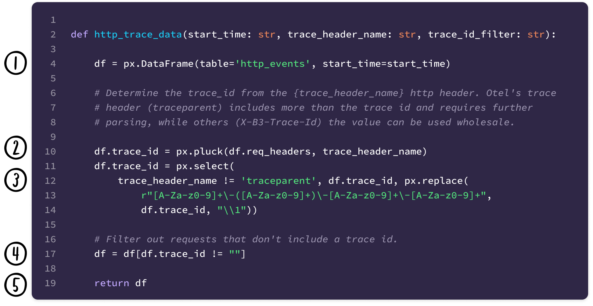
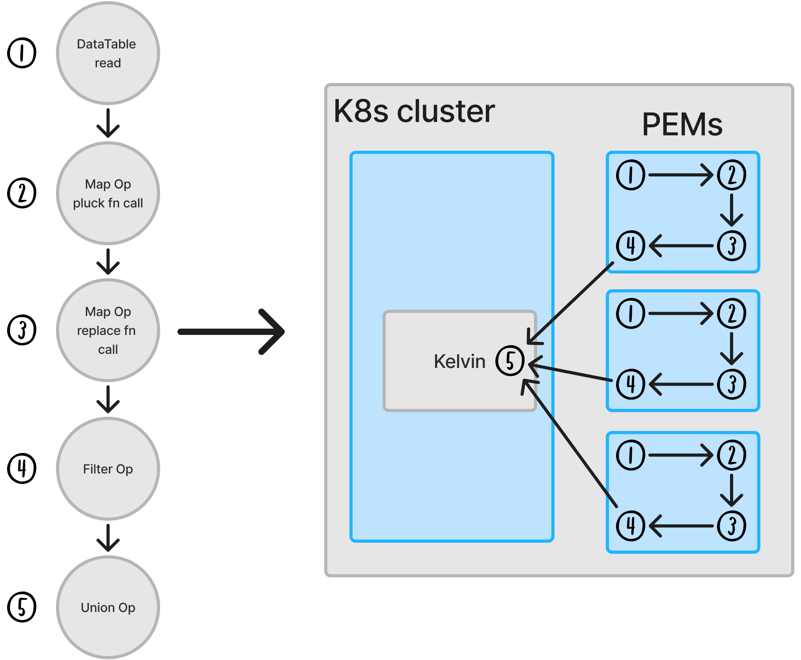
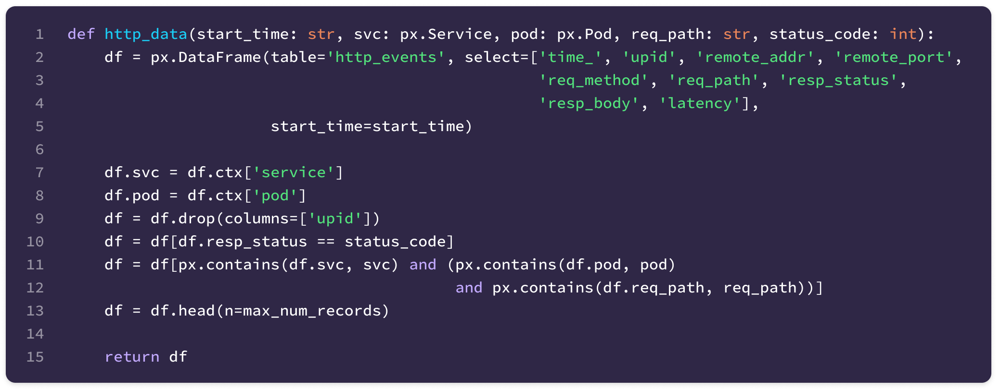
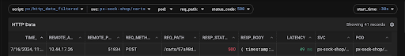
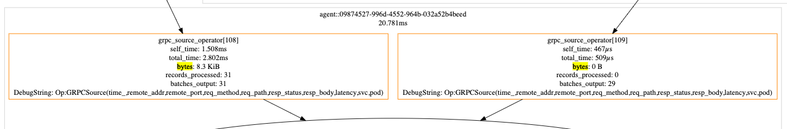
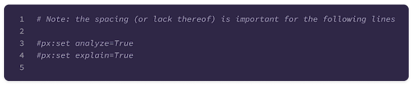
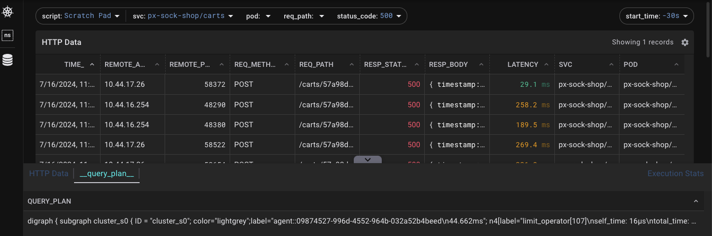

Cost has been a major concern for engineering teams and organizations since the end of the [ZIRP](https://newsletter.pragmaticengineer.com/p/zirp) (zero interest-rate period). This has forced companies to do more with less and to maximize the value of their tech stacks for their core business. At the forefront of this discussion is Observability and the traditionally centralized systems that store this high volume telemetry source. The vast majority of this data is seldom read, resulting in an expensive infrastructure insurance policy – a sunk cost until something goes wrong.

## How did we get here?

In the last 5-10 years, cloud workloads became the norm, infrastructure service providers became popular and observability standards ([OpenTelemetry](https://opentelemetry.io/)) took off. While these components helped engineering groups move quickly, it exacerbated the cost of observability backends by creating a firehose of data at every layer of the stack (microservices, cloud services, compute platforms, SaaS) and an explosion in dimensionality (containers, service oriented architectures).

While there's been innovation in the Observability space with columnar stores and pipelines, most systems continue with the centralized storage model. eBPF based Observability tools are no different, despite its event driven nature resulting in even higher volumes of telemetry.

Enter edge compute, the perfect pairing for eBPF's firehose of telemetry. Tapping into where data is generated provides the means for safeguarding access, scaling parallel processing and providing access to high granular data. [Pixie](https://px.dev), an observability tool for Kubernetes, has embraced this edge model from its inception and it's what sets it apart from other eBPF look-alikes.

Let's dive into how we architected Pixie to address this observability cost crisis.

## Pixie's edge architecture

-- Add Pixie arch image

At the center of this architecture is Pixie's per node data collector known as the Pixie Edge Module (PEM). This component is an in-memory data store that is fully programmable through our data processing language [PxL](https://docs.px.dev/reference/pxl/) and is responsible for the data collection and processing for that node. When Pixie serves a query request, the compiler within the Query Broker service transforms the python-esque script into a directed acyclic graph of operations to execute known as the query plan. This planning process determines where the operations should run and even schedules execution on the data collector nodes when possible. Pushing these operations to the PEM avoids unnecessary data transfer and parallelizes the data processing before the Kelvin service, Pixie’s aggregator, combines the final results.

Below is a PxL script that filters for http traces containing a trace ID header. It showcases how the statements map to query plan operations and where they execute in the cluster:

::: div image-xl
<figure>
  
</figure>
:::

Note: not all operations are captured in the query plan for brevity

::: div image-xl
<figure>
  
</figure>
:::

## Visualizing data processing at the edge

Now that the high-level details of PxL's query execution are covered, let's explore an example that pushes computation down to the data collectors. Built into PxL is a mechanism for outputting a Graphviz visualization of Pixie's query plan. This is crucial for debugging query processing issues and indicates what operations are assigned to which nodes and the volume of data each operation processes.

For this example, we will inspect the [px/http_data_filtered](https://github.com/pixie-io/pixie/tree/f0dadea9ed5bb4af5df2e3c3080754d3595a1e78/src/pxl_scripts/px/http_data_filtered) script available by default in Pixie (seen below). This script facilitates drilling into HTTP protocol traces and is useful for investigating the source of errors from a particular service. The traces can be filtered by http status code and Kubernetes Service name through the script's arguments and will demonstrate where the filter processing occurs within the cluster.

::: div image-xl
<figure>
  
</figure>
:::

::: div image-xl
<figure>
  
</figure>
:::

After deploying a workload to my two node Kubernetes cluster and enabling query analysis (details in the Appendix), the following GraphViz of the query execution was generated.

::: div image-xl
<svg title='Query Plan Graph' src='http_filtered_query_plan.svg' />
:::

Since this cluster contains two nodes, the aggregator service (kelvin) receives two grpc source operators – one for each PEM. Because the px-sock-shop/carts Service consists of a single pod, the query should return data from only one of the two nodes.

::: div image-xl
<figure>
  
</figure>
:::

Focusing in on the "bytes" processed by each grpc source operator, the visualization shows that one of the sources had 0 bytes (as expected) and the other contains the results of the query! While this example Service contains a single Pod, this distributed processing works the same and will be even more efficient as the cluster or data volume gets larger.

## The Future - Edge Compute driven Observability 

PxL and its edge computing runtime have powerful capabilities today, but I think these building blocks are just scratching the surface of what's possible. For a sneak peek at this, let's consider a dashboard commonly seen in observability systems – the service dashboard.

Service dashboards commonly contain LET (latency, error and throughput) metrics or SLOs on a per service basis. The latency charts graph a variety of percentiles (p50, p90, p99, etc) for the service in question and are crucial for evaluating service health.

Computing these percentiles accurately is expensive since the backend must query the unaggregated data points to perform the computation. Rather than computing these at read time, Pixie's edge processing could extend its Otel export to create cluster wide, per-service Otel histograms. Not only does this save on storage costs, but it also reduces load on the metrics backend and network transfer by serving a fraction of what would normally need to be processed (watch [pixie#1968](https://github.com/pixie-io/pixie/issues/1968) for developments in this area!).

We believe in edge compute for the future and that the future of observability will shift to these architectures. We're excited to keep exploring that realm with Pixie!

## Appendix

To recreate the GraphViz seen above, I deployed the [px-sock-shop demo](https://docs.px.dev/installing-pixie/install-guides/hosted-pixie/cosmic-cloud#6.-use-pixie-deploy-a-demo-microservices-app-(optional)) to my two node Kubernetes cluster. Once the workload is running, use the [Script Editor](https://docs.px.dev/using-pixie/using-live-ui#write-your-own-pxl-scripts-edit-an-existing-script) to add the following lines at the top of the px/http_data_filtered script.

::: div image-xl

<figure>
  
</figure>
:::

Once those lines and the arguments are modified, run the script and open up the Data Drawer (use the ctrl/cmd+d keyboard shortcut). The __query_plan__ tab will contain the GraphViz of the query execution. Generating a SVG of the GraphViz yields the following graph below:

::: div image-xl

<figure>
  
</figure>
:::
