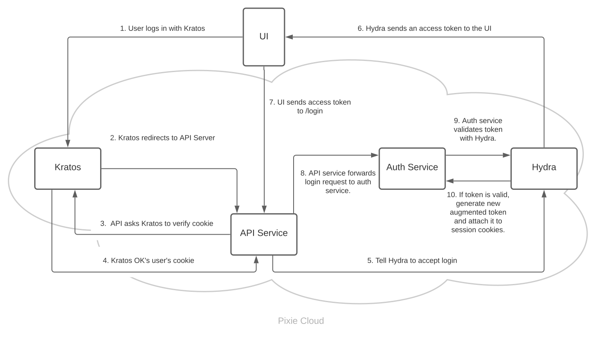

In this blog post we will discuss:

- Why we redesigned Pixie to support an authentication flow exclusively from open source components.
- The designs we considered for open source authentication, and why we selected [Hydra](https://www.ory.sh/hydra/)/[Kratos](https://www.ory.sh/kratos/).
- The technical challenges we ran into with our Hydra/Kratos-based solution, and how we addressed them.

## Context

[Pixie](https://px.dev/) is an observability platform recently acquired by New Relic. To make the project more accessible to the developer community, New Relic is open sourcing Pixie. As part of our commitment to OSS, we want Pixie to be deployable in a completely open source environment. However, Pixie had a strong dependency on Auth0 that would complicate this effort.

In this post we detail how we redesigned Pixie's auth to be open source compatible. We discuss trade offs of several approaches and dive into our final open source implementation. Let's start with our Auth0 design.

## Initial design with Auth0

Adding Auth0 to Pixie was very simple. Integrating Auth0's API took less than a day and our implementation continues to work two years later. Auth0 has been incredibly easy to use throughout the entire experience.

In our original authentication scheme (*figure below*), Pixie's UI redirects to Auth0 and receives an access token back. The UI forwards the token to the Pixie Cloud backend and the backend validates the token by making a call to the external Auth0 server.

::: div image-l

:::

Auth0 does all the heavy lifting and provides an easy way to setup different login providers - we went with Google-based Signup and Login flows. During signup, users could give us access to their name and profile picture. We incorporated this into our small profile dropdown, rounding out the user experience.

The Auth0 + Google flow was simple and worked extremely well for us. Auth0 saved development time that we later spent on our core observability product. We would recommend Auth0 to anyone who is comfortable with a hosted, third party solution.

## New requirements

Unfortunately, Auth0 does not work for Pixie's open source offering. We don't want to require open source users to depend on remotely hosted, closed source APIs. This is especially important for our users with air-gapped clusters that cannot make external network requests. We need a standalone version of Pixie that exclusively relies on open source components.

As part of this change, we also needed to enable username and password login. Our hosted implementation requires an identity from a third-party provider (ie Google) - another dependency that breaks our open source commitment. Username / password, on the other hand, can be implemented with open source libraries and works regardless of a cluster's network connectivity.

## Options

We considered three designs to support open sourced authentication in Pixie.

1. Allow users to configure their own Auth0
2. Roll our own auth
3. Use an existing open source auth library

### Option 1. Allow users to configure their own Auth0

Pros

- Minimal changes to our design
- User gets full security and feature set of Auth0

Cons

- Adds extra burden to the user during setup, does not work "out of the box"
- Does not work for air-gapped clusters
- Still reliant on a third-party solution

This option is compelling, but would limit our users to only those willing and able to open an Auth0 account. It also adds friction to get Pixie Cloud up and running, while also preventing network-isolated Pixie Cloud deployments. We want to open up as much access to Pixie Cloud as possible, so option 1 alone won't satisfy our needs.

### Option 2. Roll our own authentication

Pros

- Can tailor a solution exactly to our own needs
- Many other open source developer tools do this

Cons

- Time-intensive to do right
- Risky to get wrong

While open source projects commonly implement authentication from scratch, we're wary of spending time rolling our own solution. Pixie, like all development teams, has an engineering budget that we allocate across our products. Rolling our own auth would require us to spend a large chunk of that budget on this feature, while taking on the risk of opening security vulnerabilities if done incorrectly. We would rather rely on a project that has been built by experts and has been vetted by the open source community.

### Option 3. Use an existing open source authentication library

Pros

- Tested and used by other projects, unlike logic we roll ourselves
- Already built

Cons

- Need to integrate to fit into our existing flows

Outsourcing logic to third-party libraries is often easier said than done. Using an off-the-shelf solution sounds appealing, but integration into an existing project requires time to learn the new system and adapt it to your specific needs. The upside is that you inherit the working knowledge of the library's developers and save yourself many pains of edge-case discovery.

In this case, we felt the benefits outweighed the disadvantages. Security is extremely important to us because we deal with sensitive user data. It was worth the effort to redesign our system to use an existing solution written by security/authentication experts.

We found that a combination of [Ory](http://ory.sh)'s [Kratos](https://github.com/ory/kratos) and [Hydra](https://github.com/ory/hydra) projects best fit our needs. Many other alternatives don't provide username/password authentication, and instead rely on OAuth/OIDC. Others restrict users to pre-built UIs. Kratos and Hydra together gave us a flexible and full solution that fit our needs while also remaining accessible to anyone in the open source community.

## New authentication flow with Kratos/Hydra

Before we jump into our implementation, let's quickly discuss Kratos and Hydra's capabilities.

### What is Kratos?

At a high level, [Ory](http://ory.sh)'s [Kratos](https://github.com/ory/kratos)  is an open source system for identity and user management. Kratos supports registration, login, authentication, and other user-related tasks, all through a convenient  [REST API](https://www.ory.sh/kratos/docs/reference/api/). At the moment, Pixie only uses Kratos for username/password-based authentication, but Kratos also supports login with third-party identity providers through OIDC (ie Google Identity Platform).

Unlike our Auth0 use-case, Kratos uses stateful session cookies rather than stateless access tokens to store identity information. The most important difference is that session cookies require a service roundtrip to check authorization, while access tokens like JWTs can be verified at the endpoint, reducing the latency necessary to access an authenticated endpoint. (You can learn more about the difference [here](https://dzone.com/articles/cookies-vs-tokens-the-definitive-guide)).

Our auth design incorporates JWTs for their performance advantage, but Kratos only provides the session-cookie option. We fill this gap with Hydra.

### What is Hydra?

[Hydra](https://github.com/ory/hydra), another project by [Ory](http://ory.sh), is an open source OAuth 2.0 server and OpenID Connect provider. Hydra does not come packaged with identity or user management - instead it completely focuses on enabling API access to the OAuth flows and expects users to come with their own identity solutions (such as Kratos). An added benefit is that the project is very mature and also in production [at several notable companies.](https://github.com/ory/hydra#whos-using-it)  We use Hydra in Pixie Cloud to create the stateless access tokens we use for auth in the rest of our backend. However, we had to do some work to convert the Kratos session cookies into the access tokens.

### Integrated Kratos/Hydra design

The Kratos maintainers [intend to build an explicit integration between Hydra and Kratos](https://github.com/ory/kratos/issues/273), and they've [prototyped an integration in Javascript](https://github.com/ory/kratos-selfservice-ui-node/tree/hydra-integration). However, (at the time of writing) the integration is still a work in progress so we needed to build it ourselves.

We document our design here for reference in case future readers also want an access token based, open source, auth solution.

### Example login flow

::: div image-xl

:::

The Hydra/Kratos integration is complex, so it's easiest to demonstrate with an example. Let's break down a successful login flow. *The steps match the diagram above.*

1. User submits a form with their username and password to Kratos.
2. Kratos logs in the user, sets the session cookie, and redirects the user to an endpoint on the Pixie backend API service.
3. Pixie's API service requests Kratos to validate the session cookie.
4. Kratos responds that the cookie is valid and the user is authenticated.
5. Pixie's API service tells Hydra to accept the user's login because the user has a valid session cookie.
6. Hydra redirects the UI (via the backend API response not drawn above) to an endpoint where the UI receives an [OAuth Access Token](https://www.oauth.com/oauth2-servers/access-tokens/).
7. The UI sends the access token to the `/login` endpoint in Pixie's API service.
8. Pixie's API service, sends the login request to Pixie's Auth service.
9. Pixie's Auth service validates the access token with Hydra, to ensure that it is receiving a legitimate request from a user.
10. Hydra responds that the access token is valid, and Pixie's Auth service generates an augmented token. This augmented token is stored as part of the user's encrypted session cookie. When the UI makes subsequent requests to auth-restricted endpoints, the API-service verifies the augmented token stored in the user's session.

## Final design

With the Hydra/Kratos implementation for authentication, the following users will be able to use Pixie:

- Users who require username/password login
- Users who need a fully open source observability solution that works out of the box
- Users whose clusters cannot make external network requests

However, we still appreciate the benefits that Auth0 provides:

- Mature and battle-tested solution
- Easy to implement login with third-party accounts
- Can automatically query user email, profile, and photo to enhance our admin UI
- No need to build any UI for login or authentication flows

Given the benefits, we will still support Auth0 in Pixie. Pixie users will have the choice of configuring their deployment with Auth0 or relying on Kratos and Hydra. We reduced the auth solution to a simple interface, as shown in the following diagram.

::: div image-l

:::

We then implemented the interface with the Kratos/Hydra logic from above.

::: div image-l

:::

## Conclusion

We are big fans of both Auth0 and Ory's Hydra/Kratos. Each comes with their own sets of trade-offs and we offer both options to enable our users to choose the use case that works best for them.  Most importantly, both solutions are vetted by security experts and hardened by their wide user-base. Pixie's development team can spend less time worrying about security and instead focus on [making our no-instrumentation observability platform](https://px.dev) better. We hope this blog post will help you decide which auth solution works best for you.

If you want to dive into our auth code, check out our [Github](https://github.com/pixie-labs/pixie). If you have any questions about the topic, join our [Slack](https://slackin.px.dev/) and send us a message.
