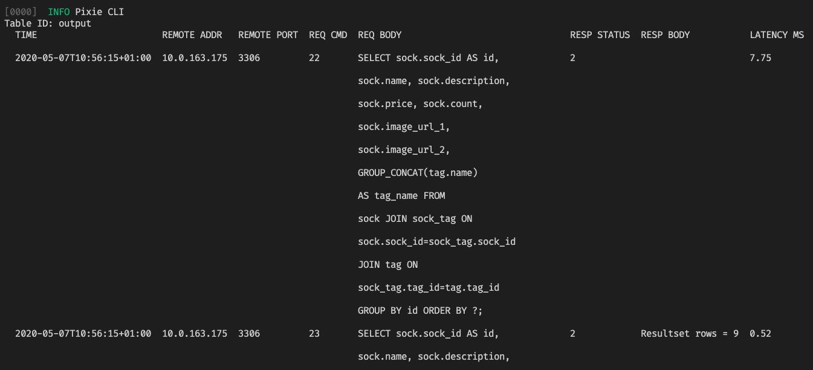
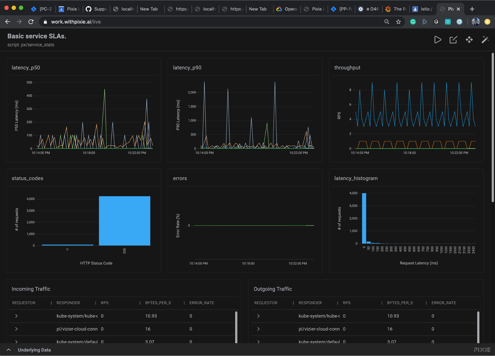
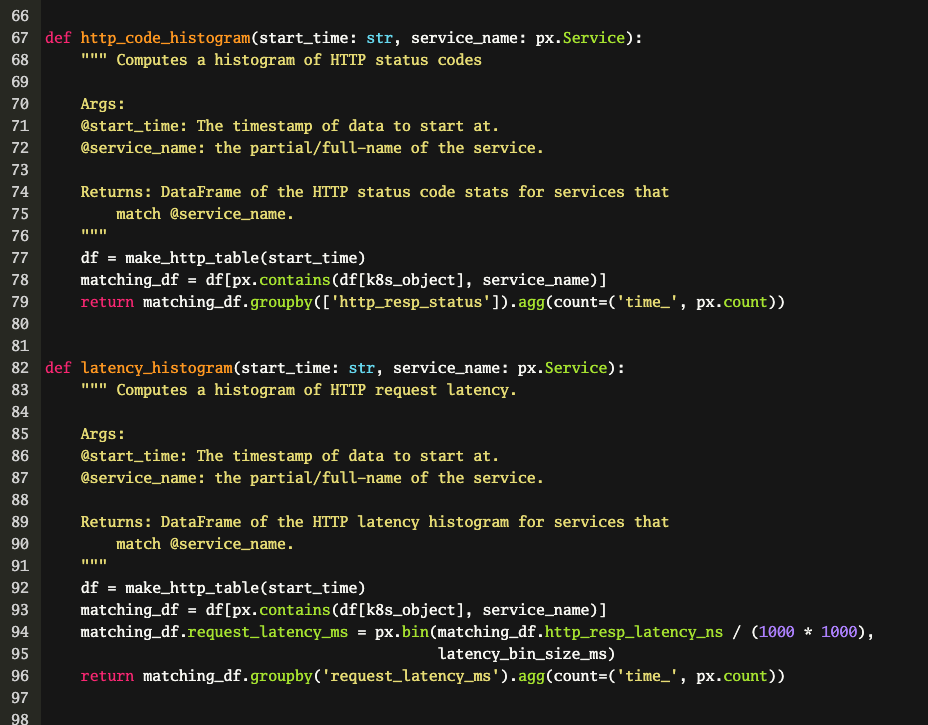
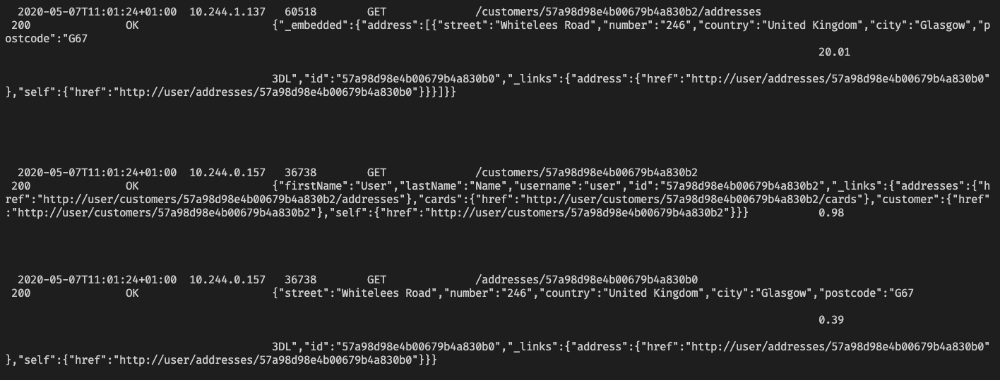
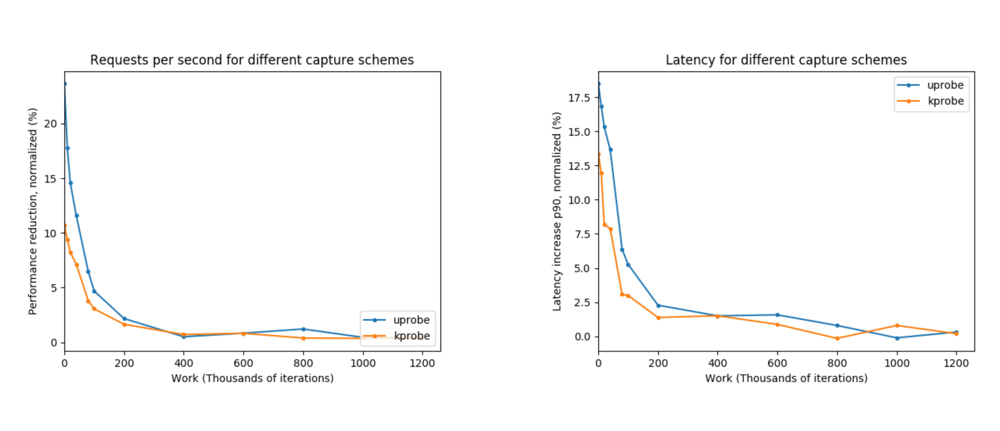

In this guest blog post, infrastructure crime-fighter John Arundel, of [Bitfield Consulting](https://bitfieldconsulting.com), enlists Pixie's help to solve the Case of the Sluggish Service.

<!-- end -->

## Episode 1: The Wire

> *I'm gonna show you as gently as I can how much you don't know.* 
—Cutty

It ain't easy being a cop. An infrastructure cop, that is. Every day on the beat, we deal with SLA parole violations, DDoS attacks, CPU stealing. Even the occasional cache poisoning.

::: div image-m

:::

As any DevOps detective will tell you, the key to effective crime-solving is information. Faced with the Case of the Sluggish Service, or the Mystery of the Elevated Error Rate, we don't have a lot to go on. We could try interviewing suspects (checking log files), recruiting informants (setting up distributed tracing probes), or even reconstructing the crime (load testing).

All these have their uses, but what we really want is a way to eavesdrop on who's saying what to whom; a way to listen in on conversations for potential criminal activity. A wiretap, if you will.

Suppose you could see every HTTP request going through your cluster, or every MySQL query going to your database. Suppose you could get instant, live stats on the throughput, response time, and error rate of every service you're running, including internal-only services. And suppose you had a spy-cam that showed you the resource usage of every process or container in your system. What would that do to your clearance rate?

There's a new recruit on the force who can help you do exactly that. [Pixie](https://docs.withpixie.ai/getting-started/what-is-pixie/) is a software tool for monitoring and tracing in Kubernetes clusters, letting you see what's going on _without_ making any code changes, or sending any customer data outside the cluster. It can reduce the time to triage issues from days to just hours.

::: div image-m

<svg title="CLI demo" src="cli-demo.svg" />

:::

You don't need to add instrumentation or tracing code to your services. You don't need to redeploy your services. You don't even need to _restart_ your services. Just put a little Pixie in your cluster, and within a few seconds it's on the case, gathering the crime-solving information you need.

## Episode 2: The Detail

> *Now you wanna know what's in the cans? Before, you wanted to know nothing. Now you ask.* 
—Spiros

So how does Pixie work? How can it see everything your containers are doing and sending over the wire, without you having to run a sidecar container, use a service mesh framework, or add instrumentation to your apps?

Well, there's a powerful tracing framework already built into the Linux kernel, called [eBPF](http://www.brendangregg.com/ebpf.html#eBPF). Originally developed to help implement packet filtering for firewalls, it turns out to be much more widely useful, because you can use it to trace any system call. And, when you think about it, practically everything involves a system call: reading files, writing data on a network connection, starting a process. You name it, eBPF can intercept it.

Pixie uses eBPF probes to intercept and record all the activity we're interested in. For example, whenever a service receives an HTTP request and sends a response, Pixie captures it. Whenever a SQL query goes to a database, and some data rows are returned, it goes into Pixie's notebook.

::: div image-m

:::

The clever part is that Pixie integrates with Kubernetes, so it can work out which pods and services are connected to which requests and actions, and it records the timestamp of everything, so it can track the throughput and latency of everything that happens.

::: div image-m

:::

Although traditional distributed tracing is still valuable, it can only answer the questions that you ask, and you have to know the questions beforehand. By contrast, Pixie can _show_ you what's going on right now, by looking deep inside the cluster and watching activity at the kernel level. It's like X-Ray Specs for your cluster.

::: div image-m

:::

Even better, it's programmable. Pixie comes with a handy set of scripts for gathering and querying data, but you can modify these, write your own, or use community-maintained scripts. These scripts are written in a special extra-complicated programming language that you'll have to learn. (Just kidding. It's Python.)

::: div image-m

:::

## Episode 3: The Cost

> *You still don't get it, do you? This ain't about your money, bro.*  
—Omar

"This all sounds great," I can hear you saying, "but I'm a little too busy to spend a bunch of time installing, setting up, and figuring out this Pixie thing, and we don't have any spare budget for SaaS products anyway. Nice idea, but I've got an inbox full of nice ideas, and the business is screaming because _things are on fire_."

::: div image-m

:::

Relax. Pixie respects your time. In fact, _time_ is the point. Pixie is quick and easy to try out. One command to install the CLI tool. One command to deploy Pixie to your cluster. That's it. You're getting data.

You don't have to install anything on your cluster nodes. You don't have to change your Kubernetes YAML files. You don't need to deploy a service mesh (thank heavens for that). In just a few minutes, Pixie can give you stats on the resource usage in your cluster, all the services you're running, and all the traffic you're handling. If you spot a problem, you can zoom in on specific HTTP or gRPC requests, or SQL queries, to see what's going wrong.

::: div image-m

:::

OK, so Pixie is here to save you time and solve your problems. Fine. But as an SRE consultant, I know there's no such thing as a free lunch. Inspecting and recording every kernel call must come with a heavy performance penalty, right?

It turns out it's not that bad. There's a small overhead, sure. But for most real-world applications it works out to less than 5%. Pixie's intelligent approach to sampling and recording means you can turn it on in production and not even worry about it. If it helps solve a mission-critical issue, that small overhead will be well worth it. Maybe you only need to turn on Pixie once in a while, to diagnose a problem. But you may well find you want it to leave it on all the time, so that when something does happen, you've already got your X-Ray Specs on.

::: div image-l

:::

"All right, I'm convinced this is worth trying," you may say. "But it sounds expensive. How much is it actually going to cost me?"

Brace yourself: not a thing. Yes, you heard that right. The community edition of Pixie is free to download, free to use, and it'll stay free forever. And everything you've just read about is included in that community edition. No time-limited 'free trial', no missing features; batteries _are_ included.

But surely those hard-working Pixie Labs engineers deserve some recompense for building such a great product? Of course, and if Pixie makes your life a tiny bit more magical, you can opt to pay a small monthly charge for the Team edition, which adds some nice features like multiplayer, online support, and archive data storage. If you _really_ love Pixie, you'll want the Enterprise edition, which is an unlimited, access-all-areas ticket to the Pixie Magic Kingdom.

The core product, though, is totally free. (It's almost like they _want_ everyone to use it!) If that's enough to make you Pixie-curious, and you're wondering how to get started, stay tuned. In the next post, I'll show you how to download and deploy Pixie, and together, we'll fight crime.

---------------------
