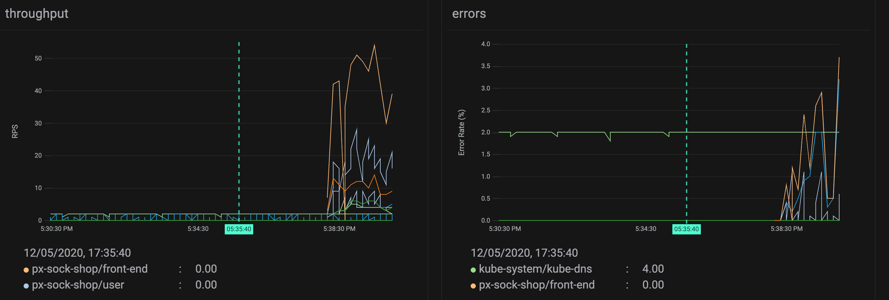

This is a guest tutorial by John Arundel, of [Bitfield Consulting](https://bitfieldconsulting.com). Hang on tight as he takes you from zero to Pixie in a few thrill-packed minutes!

<!-- end -->

## Introduction

[Pixie](https://docs.withpixie.ai/getting-started/what-is-pixie/) is a new software tool for monitoring and tracing software in Kubernetes clusters. It can generate automatic telemetry to help you live-debug your distributed system, without needing to instrument your application, or install complicated service mesh frameworks.

To learn more about how Pixie works, and why it's so valuable for SREs and infrastructure engineers, read my introductory post, [Put a Little Pixie in Your Cluster](../blog/pixie-intro).

In this tutorial, we'll see how to install the Pixie command-line tool, how to use it to deploy Pixie in your Kubernetes cluster, and how to start getting useful data on your requests and services.

## Pixie's components

Pixie has three main components:

1. The Pixie _command-line interface (CLI)_ is your interface to Pixie, which you can use to install or update Pixie, run scripts and queries, and so on.

2. The Pixie _edge module_ is the data-gathering software that runs on each Kubernetes node, tracking all the system calls and network traffic in and out of your services.

3. The Pixie _command module_ is an application that runs in your Kubernetes cluster, collecting all the data reported by the edge modules and running queries received from the CLI tool.

There's also the Pixie _control cloud_, which handles authentication, admin, and so on, but you don't need to worry about this for now, because it's hosted by Pixie Labs, and your Pixie installation knows how to talk to it automatically.

::: div image-l

:::

## Prerequisites

Here's what you'll need in order to use Pixie. First, you'll need a machine to run the CLI tool on. At the moment, this will need to be either Linux or Mac, though support for other platforms is in the pipeline.

Second, you'll need a Kubernetes cluster to run the Pixie command module. If you don't already have one, or you don't want to use your existing cluster to try out Pixie, that's fine. Pixie will work with a local Kubernetes cluster on your machine, provided by tools like [Docker Desktop](https://www.docker.com/products/docker-desktop), [Minikube](https://kubernetes.io/docs/setup/learning-environment/minikube/), and [kind](https://kind.sigs.k8s.io/). Follow one of Pixie's handy [install guides](https://docs.withpixie.ai/install-guides/) to set up a suitable cluster using the software of your choice.

Now read on!

## Installing the Pixie CLI

The first thing we need to install is `px`, the Pixie CLI tool. Once we have `px`, we can use it to deploy the Pixie command module to the cluster and get to work.

Run this command in your Linux shell or Mac terminal:

```bash:numbers
bash -c "$(curl -fsSL https://work.withpixie.ai/install.sh)"
```

If you want to know what the installer does before you run it, you can [inspect the script for yourself](https://work.withpixie.ai/install.sh) and make sure you're happy with it. All it does is download the appropriate binary executable for your platform, move it to an appropriate directory, and then prompt you to authenticate with Pixie using your browser.

Let's see what that looks like:

``` bash:numbers

  ___  _       _
 | _ \(_)__ __(_) ___
 |  _/| |\ \ /| |/ -_)
 |_|  |_|/_\_\|_|\___|

==> Info:
Pixie gives engineers access to no-instrumentation, streaming &
unsampled auto-telemetry to debug performance issues in real-time,
More information at: https://www.pixielabs.ai.

This command will install the Pixie CLI (px) in a location selected
by you, and performs authentication with Pixies cloud hosted control
plane. After installation of the CLI you can easily manage Pixie
installations on your K8s clusters and execute scripts to collect
telemetry from your clusters using Pixie.

More Info:
  https://work.withpixie.ai/docs


==> Installing PX CLI:
Install Path [/usr/local/bin]:
``` 


The default install path (`/usr/local/bin`) should be fine, unless you want to install `px` somewhere else (if so, enter the path here). Otherwise, just press Enter to continue.

```bash:numbers

==> Authenticating with Pixie Cloud:
[0000]  INFO Pixie CLI
Opening authentication URL: \
https://work.withpixie.ai:443/login?local_mode= \
true&redirect_uri=http%3A%2F%2Flocalhost%3A8085%2Fauth_complete
[0000]  INFO Starting browser

```


This will open your browser to [work.withpixie.ai](https://work.withpixie.ai/), where you'll be prompted to log in (if you have an existing Pixie account) or sign up for a new account:

::: div image-m

:::

Once you're signed in, you're ready to get your Pixie on!

## Deploying Pixie to the cluster

First, let's make sure we're pointing at the right cluster. Although Pixie can monitor activity across all your clusters, we only need to deploy the command module to one of them. A good choice for this would be the cluster where you run your existing monitoring tools, internal information systems, and so on.

Try this command to find out what your Kubernetes config says your current cluster is:

```bash:numbers
kubectl config current-context

My-Awesome-Cluster
```

If the answer isn't what you were expecting, select the right cluster by running:

```bash:numbers
kubectl config use-context My-Awesome-Cluster

Switched to context "My-Awesome-Cluster".
```

You're all set! Make Pixie go now:

```bash:numbers
px deploy

Running Cluster Checks:
 ✔    Kernel version > 4.14.0
 ✔    K8s version > 1.12.0
 ✔    Kubectl > 1.10.0 is present
 ✔    User can create namespace
Installing version: 0.3.3
Generating YAMLs for Pixie
 ✔    Generating namespace YAML
 ✔    Generating cert YAMLs
 ✔    Generating secret YAMLs
 ✔    Downloading Vizier YAMLs
Deploying Pixie to the following cluster: My-Awesome-Cluster

Is the cluster correct? (y/n) [y] :
```

Assuming it is, press Enter to continue:

```bash:numbers
Found 3 nodes
 ✔    Creating namespace
 ✔    Deleting stale Pixie objects, if any
 ✔    Deploying certs, secrets, and configmaps
 ✔    Deploying NATS
 ✔    Deploying etcd
 ✔    Deploying Cloud Connector
 ✔    Waiting for Cloud Connector to come online
Waiting for Pixie to pass healthcheck
 ✔    Wait for PEMs/Kelvin
 ✔    Wait for healthcheck

==> Next Steps:

Visit : https://work.withpixie.ai to use Pixie's UI.

Run some scripts using the px cli. For example:
- px script list : to show pre-installed scripts.
- px run px/service_stats : to run service info for sock-shop demo application (service selection coming soon!).

Check out our docs: https://work.withpixie.ai/docs.
```

That's it! You're Pixified and ready to roll.

## Running the demo app

If your cluster already has some services running in it, then Pixie will be able to give you some interesting data and views on them, so continue to the next section. If not, there's a demo application you can deploy using the CLI, to give Pixie something interesting to chew on:

```bash:numbers
px demo deploy px-sock-shop

Deploying demo app px-sock-shop to the following cluster: JIMSv2-Test-Cluster

Is the cluster correct? (y/n) [y] :
 ✔    Creating namespace px-sock-shop
 ✔    Deploying px-sock-shop YAMLs
Successfully deployed demo app px-sock-shop to cluster JIMSv2-Test-Cluster
.
==> Next Steps:

Load testing has been automatically launched for sock-shop. If you want to visit the sock-shop site,
run 'kubectl -n px-sock-shop get svc front-end --watch' to get the external IP.
When using minikube, run 'minikube tunnel' in order to ensure the external IP is accessible.
sock-shop may take a few more minutes to fully finish starting up.
```

Of course an application with no users isn't likely to generate much interesting activity for us to pore over with Pixie. So deploying the demo application also starts up a load test tool that generates a bunch of fake user traffic. Let's see what's happening!

## The Pixie browser interface

Browse to this URL to get a look at what Pixie can tell us about activity on the cluster:

https://work.withpixie.ai

The first thing you'll see is the 'Service to Service SLAs' dashboard. The two graphs at the top show _latency_ (request duration) against time:

::: div image-l

:::

This kind of display will be familiar to SREs, and you may already have something similar if you're using Prometheus and Grafana, for example.

Next is the _throughput_ (requests handled per second), and the error rate, as a percentage of requests:

::: div image-l

:::

## Running queries on the command line

While it's helpful to see this information in graph form, we can get a much more detailed view of the same data using the CLI tool:

``` bash:numbers
px run px/service_stats

Table ID: Request Latency Histogram
  REQUEST LATENCY MS  COUNT
  150                 1217
  ...
  9000                18
Table ID: Status Code Distribution
  HTTP RESP STATUS  COUNT
  500               1875
  301               2
  101               2
  406               2748
  404               2395
  202               10211
  201               15565
  200               85233
Table ID: p90 Latency
  TIME                       K8S                               LATENCY P50  LATENCY P90  LATENCY P99  ERROR RATE  RPS  BYTES PER S
  2020-05-12T17:43:40+01:00  px-sock-shop/shipping             1.62         4.00         14.59        0.00        2    205
  2020-05-12T17:50:40+01:00  px-sock-shop/front-end            44.60        2569.34      6515.74      6.70        88   3167
  2020-05-12T17:41:20+01:00  px-sock-shop/user                 2.65         10.49        35.50        0.00        56   17907
  2020-05-12T17:43:00+01:00  px-sock-shop/front-end            57.47        3075.91      7900.93      2.40        78   2807
  2020-05-12T17:43:00+01:00  pl/vizier-certmgr                 0.35         0.35         0.35         0.00        0    16
  2020-05-12T17:46:40+01:00  px-sock-shop/front-end            3.74         4876.09      5807.39      1.30        18   657
  2020-05-12T17:42:50+01:00  px-sock-shop/payment              0.38         0.69         1.76         0.00        8    450
  ...
```

There's a ton of data here and, usefully, we can also get it in JSON format, for analysis with `jq` and other JSON processing tools:

```bash:numbers
px run px/service_stats -o json |jq -r .
```

```js:numbers
{
  "_tableName_": "Request Latency Histogram",
  "request_latency_ms": 150,
  "count": 16948
}
{
  "_tableName_": "Request Latency Histogram",
  "request_latency_ms": 3600,
  "count": 12
}
...
```

## Free play

If this makes you as joyful as I think it will, you'll want to play around with Pixie now and see what else it can do. Go ahead and experiment! Try whatever commands you want: it's quite safe. `px` commands won't affect anything else running on your cluster.

The `service_stats` data we've been looking at it is just one of the query scripts supplied with Pixie. Try this command to see what other scripts are available:

```bash:numbers
px script list

Table ID: script_list
  NAME                      DESCRIPTION
  px/agent_status           Get agent status.
  px/cql_data               Sample CQL Data
  px/cql_stats              CQL Pod LET metrics
  px/funcs                  Get a list all of all funcs
                            available in Pixie.
  px/http_data              Sample HTTP Data
  px/http_request_stats     HTTP Requests Statistics by
                            Service
  px/jvm_data               JVM stats
  px/jvm_stats              JVM Stats per Pod
  px/largest_http_request   Largest HTTP Request    
  ...
```

...and many more! Have fun with Pixie, and stay tuned for the next tutorial in this series, where we'll go a little deeper and see what else Pixie can do.
