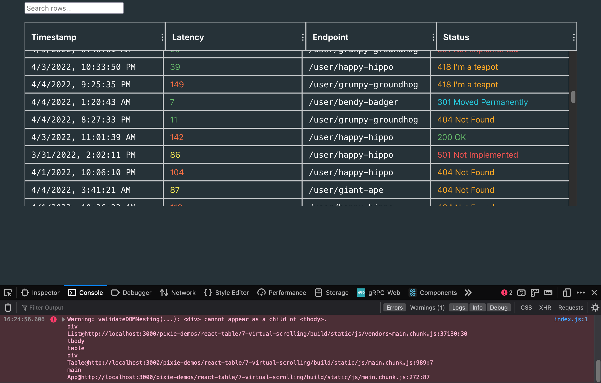
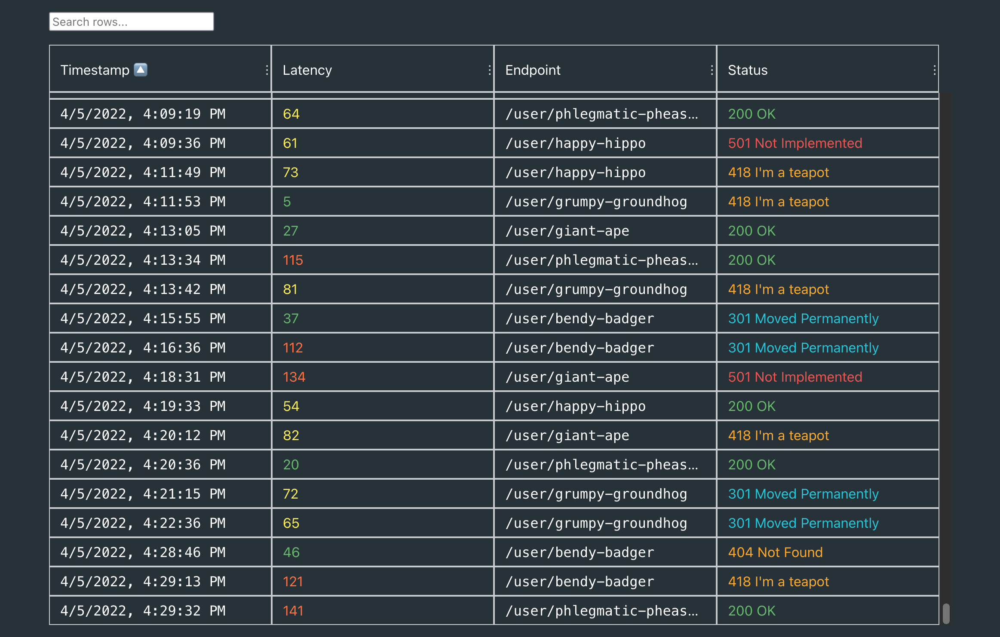

Let's build a tailing log viewer in React. Or at least, a facsimile of one.

In our [previous post](https://blog.px.dev/tables-are-hard-2/), we made a table with sorting, filtering, and column controls.

This time, we'll upgrade it to handle a constant barrage of data a bit like a log viewer would.

This tutorial is aimed at relative beginners to web development; we'll keep the set of tools and features simple to remain focused. Skip to the end for suggestions for a more serious project.

[Final Code](https://github.com/pixie-io/pixie-demos/tree/main/react-table) | [Live Demo](https://pixie-io.github.io/pixie-demos/react-table)

::: div image-xl
<figure>
  <video controls muted playsinline width="670">
    <source src="./tables-are-hard-3-full-demo.mp4" type="video/mp4" />
  </video>
  <figcaption>
    A quick video demonstration of what we'll build.
  </figcaption>
</figure>
:::

_This article is part of a series_:
- [Part 1: History](https://blog.px.dev/tables-are-hard-1)
- [Part 2: Building a Simple Data Table in React](https://blog.px.dev/tables-are-hard-2)
- **Part 3: Streaming Data**

## Setting Up

To begin, you'll need the [same basic setup](https://blog.px.dev/tables-are-hard-2/#prerequisites) as the previous article in this series:
* A modern browser.
* NodeJS &ge; 14, NPM &ge; 5.2 (NodeJS 14 comes with NPM 6).
* Something to edit code with.
* A basic understanding of the command line, HTML, CSS, JavaScript, and React.

Using the same principles as the previous article, we'll start off with a fresh template:

```shell
git clone https://github.com/pixie-io/pixie-demos.git
cd pixie-demos/react-table/6-new-base
npm install
npm start
```

If this succeeds, your browser should open a demo [like this](https://pixie-io.github.io/pixie-demos/react-table/6-new-base/build/) running on `localhost:3000`.

This template has different mock data and some adjusted CSS compared to the final demo in the previous article, but the features are unchanged.

## Excessive Data; Virtual Scrolling

Since we're looking at definitely-legitimate log data, let's see what happens if we have a few thousand rows with our current code:

<tabs>
  <tab label="App.js">
    <code-block language="diff" code={`
- const data = useStaticData(100);
+ const data = useStaticData(50_000);
    `}/>
  </tab>
</tabs>

If you save that change, the page will update itself and you'll immediately see some problems:
* Even on a fast computer, the page takes a while to show data and become responsive.
* Sorting, filtering, and resizing data makes the page freeze for a moment.
* With enough rows, it can even crash the browser tab.
* Even scrolling the table feels sluggish.

With this many rows, React spends a lot of time rendering them every time context changes[^1].
This happens on the main thread and blocks just about everything[^2].

But why update tens of thousands of rows when only a handful are visible at a time?
Can't we render just the visible rows?
This technique is called **virtual scrolling**, and it's a complex topic.

In modern browsers, virtual scrolling can be built using tools like [`IntersectionObserver`](https://developer.mozilla.org/en-US/docs/Web/API/IntersectionObserver), asynchronous scroll handlers, and a headlamp (to brave the Mines of MDN, the Sea of StackOverflow, and other odysseys).

Rather than going down that path in the [forest of all knowledge](https://youtu.be/gaQwC5QbLeQ?t=25), we'll use a pre-built solution for virtual scrolling in React: [`react-window`](https://github.com/bvaughn/react-window).

Adding it is straightforward at first.
`npm install react-window`, then a few tweaks to `Table.js`:

<tabs>
  <tab label="Table.js">
    <code-block language="diff" code={`
...
\n\
 import {
   useSortBy,
   useResizeColumns,
 } from 'react-table';
+import { FixedSizeList } from 'react-window';
 
 import './Table.css';
\n\n\
...
\n\
 export default function Table({ data: { columns, data } }) {
           ))}
         </thead>
         <tbody {...getTableBodyProps()}>
-          {rows.map((row) => {
-            prepareRow(row);
-            return (
-              <tr {...row.getRowProps()}>
+          {/*
+            * This has a few problems once we use 10,000 rows and add virtual scrolling:
+            * - At 10,000 rows, sorting and filtering slow down quite a lot. We'll address that later.
+            *   Virtual scrolling makes scrolling and resizing columns fast again, but sorting and filtering still chug.
+            * - The table's height is no longer dynamic. This can be fixed by detecting the parent's dimensions.
+            * - If the user's browser shows layout-impacting scrollbars (Firefox does so by default for example),
+            *   the header is not part of the scrolling area and thus has a different width than the scroll body.
+            *   This can be fixed by detecting how wide the scrollbar is and whether it's present, then using that
+            *   to adjust the <thead/> width accordingly.
+            */}
+          <FixedSizeList
+            itemCount={rows.length}
+            height={300}
+            itemSize={34}
+          >
+            {({ index, style }) => {
+              const row = rows[index];
+              prepareRow(row);
+              return <tr {...row.getRowProps({ style })}>
                 {row.cells.map(cell => (
                   <td {...cell.getCellProps()}>
                     {cell.render('Cell')}
                   </td>
                 ))}
               </tr>
-            );
-          })}
+            }}
+          </FixedSizeList>
         </tbody>
       </table>
     </div>
    `}/>
  </tab>
</tabs>

Saving that, we immediately see better scroll performance. But we see a few problems too:

::: div image-xl
<figure>
  
</figure>
:::

* Layout and CSS are, to put it gently, hosed. Especially in browsers with layout-impacting scrollbars[^3]!
* The browser console complains that we're no longer using a valid structure for our table.
* Scrolling rows and resizing columns are fast now, but sorting and filtering are still slow. They still manipulate the full set of rows.

To fix these issues, we'll do [a few things](https://github.com/pixie-io/pixie-demos/pull/39/commits/6062558e84e3e7e0aa7f4124f1128fb9fa56d254#diff-6009240235c0a1c9961b5cef245d5345567c0717d13b23d4035dae972ec969d4):
* CSS cleanup: fitting the table into a flexible space that won't overflow the viewport.
* Making automatic height and virtual scrolling work together: a wrapper element and a [React hook](https://github.com/pixie-io/pixie-demos/pull/39/commits/6062558e84e3e7e0aa7f4124f1128fb9fa56d254#diff-e47c761948af2625fbabc3e477be9c831c99bb0d61ce411601a35cd751a1bd4d) to pass that wrapper's dimensions to `react-window`.
* Handling scrollbar sizes: [another hook](https://github.com/pixie-io/pixie-demos/pull/39/commits/6062558e84e3e7e0aa7f4124f1128fb9fa56d254#diff-0afc591e41f1dd1168484e24a695d0a0b91dfa8db308f829ead119d7d7ba7e62) to compute sizes, and a [right margin](https://github.com/pixie-io/pixie-demos/pull/39/commits/6062558e84e3e7e0aa7f4124f1128fb9fa56d254#diff-7d2832f1a0ae342e4a04084402c04f2d9ffd3ab48474ffe723d446fd282fd08bR59) on the table's header
* Invalid DOM: we aren't supposed to mix native `<table>` elements with `<div>`s. Switching to entirely use `<div>`s corrects that. We can use the [`role` attribute](https://developer.mozilla.org/en-US/docs/Web/Accessibility/ARIA/Roles), which `react-table` provides through `getTableBodyProps()` and friends, to keep semantic HTML and keep screen readers happy.

With those fixes in place, we have a much nicer demonstration of virtual scrolling.

::: div image-xl
<figure>
  
</figure>
:::

## Streaming Even More Data

Now imagine the server is streaming chunks of log data to add to the table every second.
How should we handle that?

First, let's stop imagining and actually implement a (mock) data stream:
<tabs>
  <tab label="useData.js">
    <code-block language="jsx" code={`
export function useStreamingData(
  rowsPerBatch = 5, delay = 1000, maxBatches = 100
) {
  const [minTimestamp, setMinTimestamp] = React.useState(
    Date.now() - 1000 * 60 * 60 * 24 * 7 // Logs since last week
  );
  const [batches, setBatches] = React.useState([]);
\n\
  const addBatch = React.useCallback(() => {
    if (batches.length >= maxBatches) return;
    const batch = Array(rowsPerBatch).fill(0).map(
      (_, i) => generateRow(
        minTimestamp + i * 1000,
        minTimestamp + i * 1999
      )
    );
    setBatches([...batches, batch]);
    setMinTimestamp(minTimestamp + rowsPerBatch * 2000);
  }, [batches, maxBatches, minTimestamp, rowsPerBatch]);
\n\
  React.useEffect(() => {
    const newTimer = global.setInterval(addBatch, delay);
    return () => {
      global.clearInterval(newTimer);
    };
  }, [delay, addBatch]);
\n\
  return React.useMemo(
    () => ({ columns, data: batches.flat() }),
    [batches]
  );
}
    `}/>
  </tab>
  <tab label="App.js">
    <code-block language="diff" code={`
- import { useStaticData } from './utils/useData.js';
+ import { useStreamingData } from './utils/useData.js';
\n\n\
...
\n\
- const data = useStaticData(50_000);
+ const data = useStreamingData();
    `}/>
  </tab>
</tabs>

This doesn't do much: it just adds a new chunk of rows to the data going to `react-table` every second, up to a (low) safety limit.
We'll increase the amount of data and the rate in a moment; but first we have new problems to solve:

::: div image-xl
<figure>
  <video controls muted playsinline width="670">
    <source src="./8a.mp4" type="video/mp4" />
  </video>
  <figcaption>
    Streaming Broke Everything: A Case Study
  </figcaption>
</figure>
:::

* Scroll position jumps to the top every time a batch is added.
* Sorting and filtering both reset every time a batch is added.
* Virtual scrolling doesn't render until you scroll again; blank rows appear instead.

What gives? Everything was working a moment ago.

Every time we change the data backing our instance of `react-table`, both it and `react-window` reset a number of variables.
Luckily for us, these have easy solutions:

* Sorting, column resizing: we can turn that resetting behavior off by adding `autoResetSortBy: false` and `autoResetResize: false` to the `useTable` configuration.
* Scroll reset, blank rows: a bit of `React.memo` clears that right up[^4].

<tabs>
  <tab label="Table.js">
    <code-block language="diff" code={`
+const TableContext = React.createContext(null);
+
+/**
+ * By memoizing this, we ensure that react-window can recycle rendered rows that haven't changed when new data comes in.
+ */
+const BodyRow = React.memo(({ index, style }) => {
+  const { rows, instance: { prepareRow } } = React.useContext(TableContext);
+  const row = rows[index];
+  prepareRow(row);
+  return (
+    <div className={styles.Row} {...row.getRowProps({ style })}>
+      {row.cells.map(cell => (
+        <div className={styles.BodyCell} {...cell.getCellProps()}>
+          {cell.render('Cell')}
+        </div>
+      ))}
+    </div>
+  );
+});
+
+/**
+ * Setting outerElementType on FixedSizeList lets us override properties on the scroll container. However, FixedSizeList
+ * redraws this on every data change, so the wrapper component needs to be memoized for scroll position to be retained.
+ *
+ * Note: If the list is sorted such that new items are added to the top, the items in view will still change
+ * because the ones that _were_ at that scroll position were pushed down.
+ * This can be accounted in a more complete implementation, but it's out of scope of this demonstration.
+ */
+const ForcedScrollWrapper = React.memo((props, ref) => (
+  // Instead of handling complexity with when the scrollbar is/isn't visible for this basic tutorial,
+  // instead force the scrollbar to appear even when it isn't needed. Not great, but out of scope.
+  <div {...props} style={{ ...props.style, overflowY: 'scroll' }} forwardedRef={ref}></div>
+));
+
-export default function Table({ data: { columns, data } }) {
+const Table = React.memo(({ data: { columns, data } }) => {
   const reactTable = useTable({
       columns,
       data,
+      autoResetSortBy: false,
+      autoResetResize: false,
     },
     useFlexLayout,
     useGlobalFilter,
     useSortBy,
     useResizeColumns
  );
\n\
  const {
    getTableProps,
    getTableBodyProps,
    headerGroups,
    rows,
    allColumns,
-   prepareRow,
    setGlobalFilter
  } = reactTable;
\n\n\
  const { width: scrollbarWidth } = useScrollbarSize();
  const [fillContainer, setFillContainer] = React.useState(null)
  const fillContainerRef = React.useCallback((el) => setFillContainer(el), []);
  const { height: fillHeight } = useContainerSize(fillContainer);
\n\n\
+  const context = React.useMemo(() => ({
+    instance: reactTable,
+    rows,
+    // By also watching reactTable.state specifically, we make sure that resizing columns is reflected immediately.
+    // eslint-disable-next-line react-hooks/exhaustive-deps
+  }), [reactTable, rows, reactTable.state]);
+
   return (
+    <TableContext.Provider value={context}>     
       <div className={styles.root}>
         <header>
           <ColumnSelector columns={allColumns} />
           <Filter onChange={setGlobalFilter} />
         </header>
         <div className={styles.fill} ref={fillContainerRef}>
           <div {...getTableProps()} className={styles.Table}>
             <div className={styles.TableHead}>
               ...
             </div>
             <div className={styles.TableBody} {...getTableBodyProps()}>
               <FixedSizeList
-                outerElementType={(props, ref) => (
-                  // Instead of handling complexity with when the scrollbar is/isn't visible for this basic tutorial,
-                  // we'll instead force the scrollbar to appear even when it isn't needed. Suboptimal, but out of scope.
-                  <div {...props} style={{ ...props.style, overflowY: 'scroll' }} forwardedRef={ref}></div>
-                )}
+                outerElementType={ForcedScrollWrapper}
                 itemCount={rows.length}
                 height={fillHeight - 56}
                 itemSize={34}
+                onItemsRendered={onRowsRendered}
               >
-                {({ index, style }) => {
-                  const row = rows[index];
-                  prepareRow(row);
-                  return <div className={styles.Row} {...row.getRowProps({ style })}>
-                    {row.cells.map(cell => (
-                      <div className={styles.BodyCell} {...cell.getCellProps()}>
-                        {cell.render('Cell')}
-                      </div>
-                    ))}
-                  </div>
-                }}
+                {BodyRow}
               </FixedSizeList>
             </div>
           </div>
         </div>
       </div>
     </div>
+   </TableContext.Provider>
   );
-}
+});
+
+export default Table;
    `}/>
  </tab>
</tabs>

## Frills

We're nearly done now.
For a bit of final polish, we'll tweak `useData.js` one more time to keep adding more data and removing old data when it hits the limit;
we'll also add a counter under the table to track visible and total rows.
While we're here, let's default to sorting by timestamp too.

<tabs>
  <tab label="Table.js">
    <code-block language="diff" code={`
...\n\n\
     const reactTable = useTable({
       columns,
       data,
       autoResetSortBy: false,
       autoResetResize: false,
+      disableSortRemove: true,
+      initialState: {
+        sortBy: [{ id: 'timestamp', desc: false }],
+      },
     },
     useFlexLayout,
     useGlobalFilter,
     useSortBy,
     useResizeColumns
   );
\n\n\
   ...
\n\n\
+  const [visibleStart, setVisibleStart] = React.useState(1);
+  const [visibleStop, setVisibleStop] = React.useState(1);
+  const viewportDetails = React.useMemo(() => {
+    const count = visibleStop - visibleStart + 1;
+    let text = \`Showing \${visibleStart + 1} - \${visibleStop + 1} / \${rows.length} records\`;
+    if (rows.length === 500) text += ' (most recent only)';
+
+    if (count <= 0) {
+      text = 'No records to show';
+    } else if (count >= rows.length) {
+      text = '\xa0'; // non-breaking space
+    }
+    return text;
+  }, [rows.length, visibleStart, visibleStop]);
+
+  const onRowsRendered = React.useCallback(({ visibleStartIndex, visibleStopIndex }) => {
+    setVisibleStart(visibleStartIndex);
+    setVisibleStop(visibleStopIndex);
+  }, []);
\n\n\
   ...
\n\n\
   return (
     <TableContext.Provider value={context}>     
       <div className={styles.root}>
         <header>
           <ColumnSelector columns={allColumns} />
           <Filter onChange={setGlobalFilter} />
         </header>
         <div className={styles.fill} ref={fillContainerRef}>
           <div {...getTableProps()} className={styles.Table}>
             <div className={styles.TableHead}>
               ...
             </div>
             <div className={styles.TableBody} {...getTableBodyProps()}>
               ...
             </div>
           </div>
         </div>
+        <div className={styles.ViewportDetails} style={{ marginRight: scrollbarWidth }}>
+          {viewportDetails}
+        </div>
       </div>
     </div>
    </TableContext.Provider>
   );
...
    `}/>
  </tab>
  <tab label="Table.module.css">
    <code-block language="diff" code={`
+.ViewportDetails {
+  flex: 0 1 auto;
+  font-size: 1rem;
+  text-align: right;
+  border-top: 1px white solid;
+  padding-top: 1em;
+}
    `}/>
  </tab>
  <tab label="useData.js">
    <code-block language="diff" code={` export function useStreamingData(rowsPerBatch = 5, delay = 1000, maxBatches = 100) {
   const [minTimestamp, setMinTimestamp] = React.useState(Date.now() - 1000 * 60 * 60 * 24 * 7);
   const [batches, setBatches] = React.useState([]);
\n\n\
   const addBatch = React.useCallback(() => {
-    if (batches.length >= maxBatches) return;
+    // If we're at the limit, remove the oldest batch before adding a new one.
+    if (batches.length >= maxBatches) batches.shift();
\n\n\
     const batch = Array(rowsPerBatch).fill(0).map(
       (_, i) => generateRow(minTimestamp + i * 1000, minTimestamp + i * 1999));
     setBatches([...batches, batch]);
     setMinTimestamp(minTimestamp + rowsPerBatch * 2000);
   }, [batches, maxBatches, minTimestamp, rowsPerBatch]);
\n\n\
+  // Start with one batch already loaded
+  React.useEffect(() => {
+    addBatch();
+    // eslint-disable-next-line react-hooks/exhaustive-deps
+  }, []);
\n\n\
   React.useEffect(() => {
     const newTimer = global.setInterval(addBatch, delay);
     return () => {
       global.clearInterval(newTimer);
     };
   }, [delay, addBatch]);
   return React.useMemo(() => ({ columns, data: batches.flat() }), [batches]);
 }
    `}/>
  </tab>
</tabs>

At last, we have a fully working demo (click to interact):

::: div
<div style="margin-top:2em;width:100%;height:600px;padding:0;overflow:hidden;">
  <iframe width="133%" height="133%" style="border-width: 1px 0 1px 0;border-color: rgba(0, 0, 0, 0.5); border-style:solid;transform:scale(0.75);transform-origin: 0 0;" src="https://pixie-io.github.io/pixie-demos/react-table/8-streaming-data/build/" />
</div>
:::

## Conclusion

With our [final code](https://github.com/pixie-io/pixie-demos/tree/main/react-table/8-streaming-data), we've built a [complete demo](https://pixie-io.github.io/pixie-demos/react-table/8-streaming-data/build):

* Data streams to the table constantly, without interrupting scrolling or sorting.
* Data can be sorted and filtered.
* Columns can be selectively resized and hidden.
* The table continues to perform smoothly indefinitely.

While this doesn't cover nearly everything that a real log viewer does, it does introduce one of the harder topics.

There's a great deal more to explore in this space, especially in terms of browser performance and complex data.
Tables are hard, but we hope these articles have provided a foundation to learn and build something awesome yourself.

[^1]: React 18 [can help a little bit](https://reactjs.org/blog/2022/03/29/react-v18.html) with this if you're clever, but you're better off fixing the root cause(s) first.
[^2]: JavaScript's event loop, web workers, DOM repaints, and more are out of scope for this tutorial. [This primer](https://web.dev/rendering-performance/) on the pixel pipeline is a good start if you wish to learn the basics. Performance is complicated!
[^3]: By default, scrollbars in Firefox take up space and affect layout. This used to be normal in all browsers. These days, most browsers overlay scrollbars as if they had a width of zero. You can detect this with `element.offsetWidth - element.clientWidth` (`element.offsetHeight - element.clientHeight` for horizontal scrollbars). If the element isn't scrolling or if scrollbars are set to overlay, these values will be 0; if not, they'll tell you how much space the scrollbars take up.
[^4]: We wrote [a blog post on memoization](https://blog.px.dev/ui-performance). For this code, it's to retain state and not for performance.
