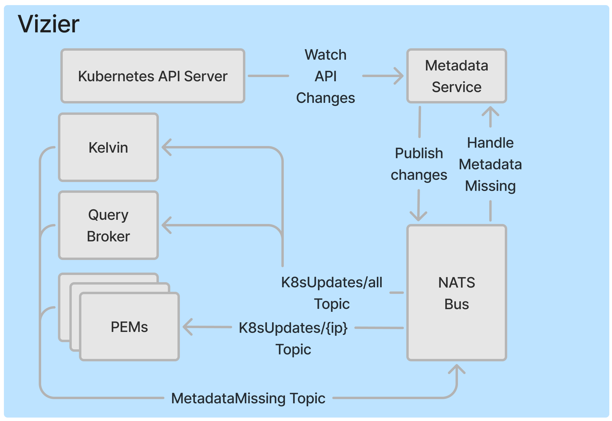

Telemetry data is only as useful as the context it provides—unlocking its full potential requires consulting service platform infrastructure (Kubernetes, etc) for essential metadata about the workload in question. Modern systems provide APIs for this metadata, however, as the recent [OpenAI outage](https://status.openai.com/incidents/ctrsv3lwd797) demonstrated, querying this metadata at scale can inadvertently introduce critical risks. This outage resulted from a new telemetry service that overwhelmed the Kubernetes control plane and led to a cascading failure that took services offline for hours. Despite observability infrastructure existing outside of the path of serving live traffic, this incident highlights that these pipelines must be carefully designed to prevent critical service disruptions.

Since [Pixie’s](https://px.dev) core function is to instrument applications running on Kubernetes, service metadata is crucial to provide deeper insights and usability. Pixie's Vizier component, deployed directly on the instrumented Kubernetes cluster, enriches raw telemetry data and enables efficient query execution by associating the relevant Kubernetes entities like Pods, Services, and Deployments.

The OpenAI outage serves as a stark reminder of how reliance on Kubernetes metadata can unintentionally jeopardize system reliability without the proper safeguards. Scaling bottlenecks like these often remain hidden in production until a perfect storm exposes them, making them difficult to diagnose and address. A system might be deemed stable, only for latent issues to surface under unforeseen conditions.

Pixie’s architecture, by contrast, is purposefully designed to avoid such pitfalls. By minimizing disruption to the Kubernetes control plane, Pixie enables scalable observability without compromising production workloads. Let’s explore how Pixie achieves this balance and why its design philosophy stands out as a model for reliability.

## Pixie Architecture

Before looking at Pixie's metadata service design, it's helpful to understand Pixie's architecture and design decisions. Pixie leverages eBPF to capture all RPC spans between services in a K8s cluster. Since eBPF is event driven and microservice traffic is high volume, Pixie was designed with the assumption that this data source would be prohibitive to centrally store by default – if your services saturate a Node's network interface with real traffic, storing a second copy of this data would starve the network! Therefore, Pixie's architecture is edge compute based and consists of data collectors (PEMs) that function as in-memory databases.

The data collected by each PEM remains in-memory until a query requesting the data arrives. In order to support this model, Pixie must fan out queries to the individual PEMs and aggregate the results. This is served by the Query broker and Kelvin (aggregator) services respectively.

## Importance of Kubernetes Metadata

Observability data collectors require rich workload context to annotate metrics, logs and traces. Without this information, the telemetry data would provide more noise than signal. Pixie is no different in this regard–its data collector also needs metadata; however, the edge compute model has some additional considerations: fanning out every query to all PEMs is inefficient and PEMs should have memory efficient data storage. The key to addressing both of these challenges lies in leveraging Kubernetes metadata to maximize the strengths of this edge based architecture.

For the Query broker to efficiently query a cluster's PEMs, it must first understand where workloads are located within the cluster. This knowledge allows it to optimize query execution by targeting only the PEMs that store the relevant data, avoiding unnecessary fan-out.

To ensure memory efficiency, PEMs avoid storing dimensional data (e.g. string key-value pairs) inline, as doing so would significantly increase storage requirements in its in-memory database. Instead, each PEM uses a "Universal PID" (UPID) to uniquely identify processes and pairs this with a local metadata store. When a query is executed, the PEM hydrates the telemetry data on demand, efficiently reconstructing the necessary context.

The diagram below highlights each component within a Vizier and the metadata access to serve a Pixie query. Note that the metadata requirements fall into two categories: Node local view and Cluster wide view.


With Pixie's architecture and metadata needs understood, let's shift focus to the metadata service and how it fulfills these requirements.

## Metadata Service Design

To efficiently manage metadata access across Pixie’s components, we needed a solution that avoided overwhelming the Kubernetes API server. Since the Vizier components run on every Node—the PEM is deployed as a DaemonSet—it would be untenable for each component to communicate directly with the API server. To solve this, we designed a metadata service that leverages a pubsub model to distribute updates.

This pubsub approach allows each Pixie component to subscribe to the metadata relevant for itself while only having one connection to the Kubernetes API server. For instance, PEMs subscribe to updates specific to their Node, while Kelvin and the Query broker subscribe to a cluster-wide topic. After evaluating several options, we selected the lightweight and high-throughput NATS message broker for this system. NATS easily handles the rate of Kubernetes object changes and ensures scalability for clusters of any size.

## Publishing Metadata Changes to NATS

The Kubernetes API server provides a watch API for efficiently tracking resource changes. This API allows clients to request the current state of resources and receive a resourceVersion, which is used in subsequent "watch" requests to retrieve incremental updates. For example:

```bash
GET /api/v1/namespaces/test/pods
---
200 OK
Content-Type: application/json

{
  "kind": "PodList",
  "apiVersion": "v1",
  "metadata": {"resourceVersion":"10245"},
  "items": [...]
}

GET /api/v1/namespaces/test/pods?watch=1&resourceVersion=10245
---
200 OK
Transfer-Encoding: chunked
Content-Type: application/json

{
  "type": "ADDED",
  "object": {"kind": "Pod", "apiVersion": "v1", "metadata": {"resourceVersion": "10596", ...}, ...}
}
{
  "type": "MODIFIED",
  "object": {"kind": "Pod", "apiVersion": "v1", "metadata": {"resourceVersion": "11020", ...}, ...}
}
...
```

To simplify consuming this stream of events, Kubernetes offers an abstraction called [informers](https://pkg.go.dev/k8s.io/client-go/informers), which are built on top of the watch API. The metadata service leverages informers to track resource changes and publishes updates to the NATS bus for Pixie’s components to consume.

## Designing Resiliency in the system

Distributed systems are inherently prone to failures, so it’s critical to ensure that Pixie’s components can recover and remain consistent with the current state of Kubernetes. To achieve this, every resource update published to NATS is annotated with a Pixie-materialized resourceVersion.

If a component misses an update—for instance, due to downtime—it can inform the metadata service of its last known version by publishing to a "metadata missing" topic. The service then provides all subsequent updates, ensuring eventual consistency across all components.

To support this recovery mechanism, the metadata service durably stores updates from the API server with the Pixie-materialized resourceVersion. When persistent volumes are available, the metadata service uses a [Pebble database](https://github.com/cockroachdb/pebble) backed by a PVC. This ensures that the service can restart without data loss and fulfill missed update requests. In clusters without persistent volume support, the service falls back to an etcd cluster, which offers persistence at the cost of reduced performance.

[](pixie-metadata-service.png)

## Extension beyond in-cluster use

The system outlined above has served Pixie well, but it's also accommodated additional use cases. Pixie's UI provides an interface for writing queries and we later wanted to support query autocompletion. This meant Pixie's Cloud component needed the same cluster-wide metadata events consumed by the Kelvin and Query broker services. This was surprisingly easy to support and required minimal changes on the metadata service side. This highlights how extensible this architecture is and allowed us to reuse the same data source used by the in-cluster components.

## Conclusion

Pixie’s metadata service is an important part of its architecture, enabling telemetry enrichment and efficient distributed query execution while safeguarding the Kubernetes control plane. While Pixie's edge compute model is unique, the metadata service's built-in resiliency, and extensibility make it a compelling example of how observability systems can be thoughtfully designed to meet the needs of modern, large-scale microservice environments.
