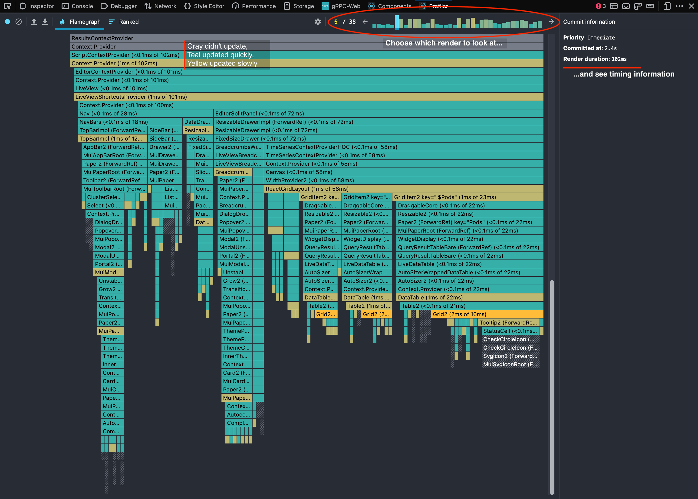
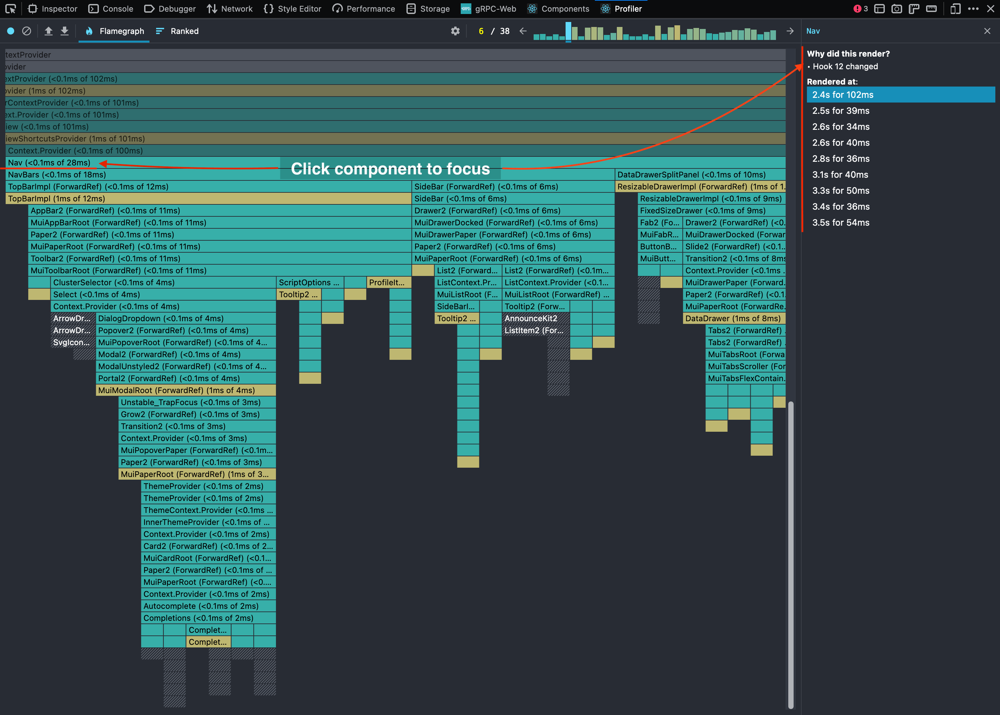
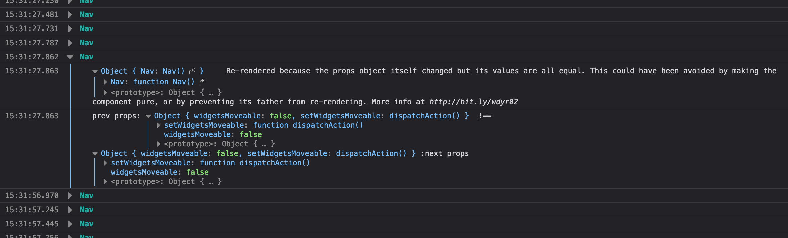
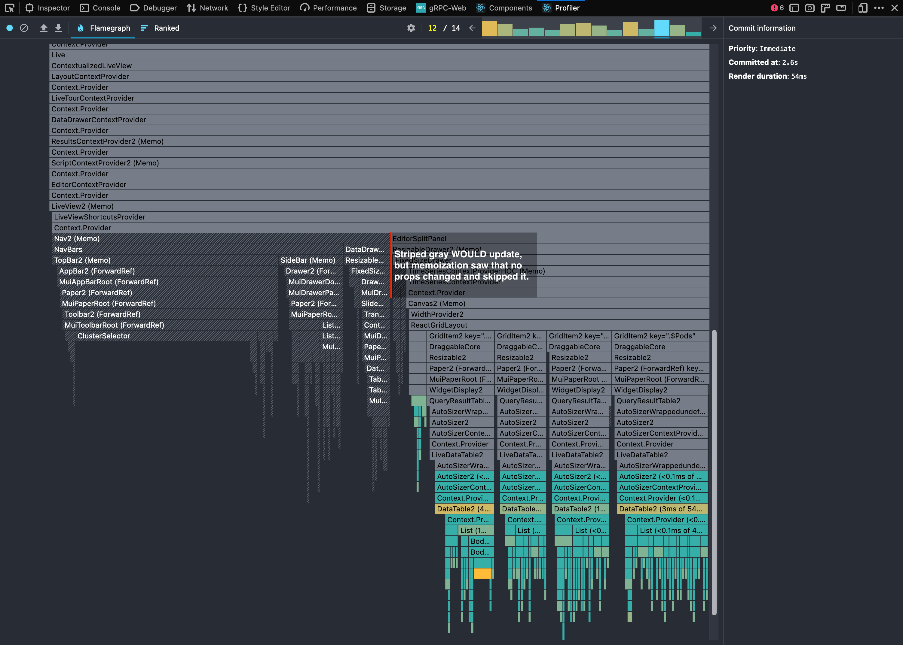

You have a sluggish React web app on your hands. Why is it slow? How do you fix it?
React's documentation [offers some tips](https://reactjs.org/docs/optimizing-performance.html).
In this post, we'll walk through debugging excessive re-rendering, a common performance problem that surfaced in Pixie's UI.
We'll show how we fixed it, and how we're preventing it from resurfacing.

::: div image-xl
<figure>
  <video controls muted loop playsinline width="670">
    <source src="performance-comparison.mp4" type="video/mp4" />
  </video>
  <figcaption>
    Here, "Highlight Updates When Components Render" is enabled in React DevTools.
    Each rectangular flash is a component update.
  </figcaption>
</figure>
:::

**TL;DR**: Most of our React components were re-rendering too often. Memoizing them fixed it.
We used React Dev Tools and Why Did You Render to find the worst offenders, then added an eslint rule to remind us to use more memoization going forward.

## Profiling With React DevTools

To find the problem, we used the official [React DevTools](https://reactjs.org/docs/optimizing-performance.html#profiling-components-with-the-devtools-profiler) browser extension.
It can show the full component tree, state, props, and errors.
It can also take a profile of application performance to show which components are rendering, when, why, and how long they take to render.

Let's use this to profile our UI when it renders charts, tables, and graphs of data that it gets from executing a function upstream.
Opening the Profiler tab in the browser's dev tools, we start a profile, trigger the problematic action in the UI, and stop the profile.
After it finishes processing, we find the moment we care about:

::: div image-xl
<figure>
  
</figure>
:::

...ouch. This profile shows us that almost the entire app updated! Each bar represents a React component in a given React render. Color indicates activity:
- **Gray components** didn't render
- **Teal components** rendered quickly
- **Yellow components** rendered slowly

Generic toolbars shouldn't care what's happening in data tables elsewhere on the page.
Likewise, dropdowns don't need to update while they're closed.
So why did they update? Let's focus on the toolbars first:

::: div image-xl
<figure>
  
</figure>
:::

By clicking on the `Nav` component, we get some more info: what caused it to render at this moment, and when else in the profile it rendered.
Here, we see that a hook changed, but we're not sure which hook or why yet.

## Why Did You Render?

React DevTools isn't providing quite the detail we need here, so let's use another tool that can: [Why Did You Render](https://github.com/welldone-software/why-did-you-render) (WDYR).
This tool finds potentially avoidable re-renders, by logging when components update without their inputs changing.
After a [little setup](https://github.com/pixie-io/pixie/blob/main/src/ui/src/wdyr.js), WDYR can be attached with `SomeComponent.whyDidYouRender = true;` after its definition.
Doing this for `Nav`, we see a console message when we run our test again:

::: div image-xl
<figure>
  
</figure>
:::

Conveniently, WDYR tells us exactly what's wrong: `Nav` isn't a pure component.
For a handy guide on how to interpret WDYR console logs, check out [this post](https://medium.com/welldone-software/why-did-you-render-mr-big-pure-react-component-part-2-common-fixing-scenarios-667bfdec2e0f).
Note that this is a small sample of what WDYR can do; the tool is incredibly easy to configure and explains its findings clearly.

Now, why do we care if `Nav` is a [pure component](https://reactjs.org/docs/react-api.html#reactpurecomponent)?
Because **unless you tell React that your component will do the same thing if it gets the same inputs twice[^1] (a "pure" function), React assumes it has side effects and renders it again.**

This can cause a wasteful update cascade: if a component re-renders with recomputed values, then its children receive new inputs (even if they're identical) and repeat this process downward.

By contrast, React memoizes components we mark as pure: it remembers what the component rendered when given specific inputs, and recycles that output if it sees those same inputs again.
This lets it skip rendering the component entirely, saving time.
It can do the same thing with computed values inside a component, with hooks like [useMemo](https://reactjs.org/docs/hooks-reference.html#usememo) [^2].

## Memoizing Everything

Okay, let's throw memoization at everything[^3] that isn't nailed down.
Using React DevTools and WDYR like above, we found the worst offenders and [fixed them](https://github.com/search?o=desc&q=author%3ANickLanam+repo%3Apixie-io%2Fpixie+%22%5D+Memoize%22+OR+%22rerenders%22&s=committer-date&type=Commits).
For the most part, this meant wrapping various components in `React.memo` and computed values in `React.useMemo` or similar.
Eventually, a typical profile when the UI starts rendering results looked like this:

::: div image-xl
<figure>
  
</figure>
:::

## Prevention Through Linting

To prevent needless re-renders from sneaking back into Pixie's UI, we added the [eslint-plugin-react-memo](https://github.com/steadicat/eslint-plugin-react-memo) lint rules to enforce memoization.
Its author wrote a [compelling article](https://attardi.org/why-we-memo-all-the-things/) on why this is a sensible default.
The rationale is simple: most of the time, your component is pure.
Mark it that way unless you have a compelling reason not to.
The same goes for values that don't need to be recomputed often.

## Summary

Before this investigation, Pixie's UI was full of bright-eyed, eager React components ready to update at the first sign of action.
We've wisened them up to only update when something they care about changes, using popular tools and built-in features of React.
With less noise blocking the main thread, the UI is much more responsive now.
We then added tooling to remind ourselves to keep up this habit.

::: div image-xl
<figure>
  <video controls muted loop playsinline width="670">
    <source src="performance-comparison.mp4" type="video/mp4" />
  </video>
  <figcaption>
    Shorter renders add up to a snappier response.
    This even reduced the time between clicking "Run" and the API call being sent.
  </figcaption>
</figure>
:::

Combined, the time between a user click and showing results went from ~4.1 seconds to ~2.4, a 1.7 second improvement.
The network accounts for roughly 0.2 seconds in both cases.

There are further improvements we can make, of course, but this was a significant first step.

[^1]: "Inputs" here means props, state, hooks including `useContext`, and anything else React watches.
[^2]: Memoizing computed values guarantees stable object identities (useful for equality checks in props).
[^3]: Pure components rely on stable results. Side effects like raw DOM manipulation break this assumption.

_Questions? Suggestions? Find us on [Slack](https://slackin.px.dev/), [GitHub](https://github.com/pixie-io/pixie/blob/main/CONTRIBUTING.md), or Twitter at [@pixie_run](https://twitter.com/pixie_run)._
